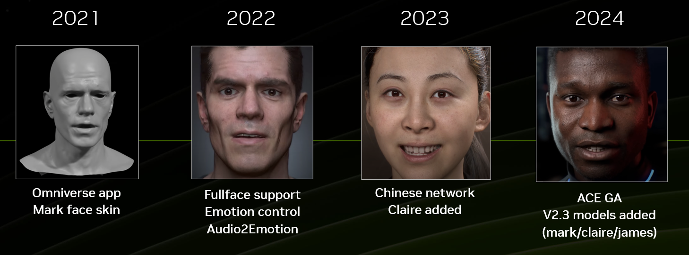
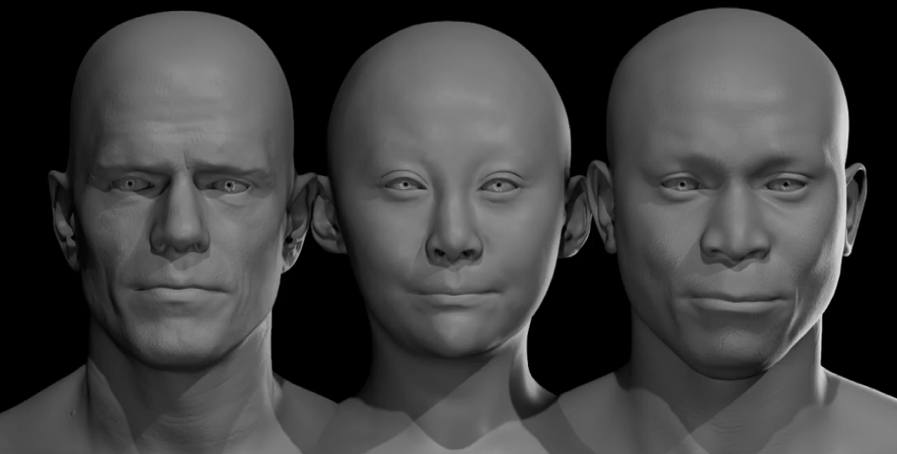
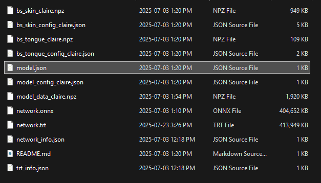
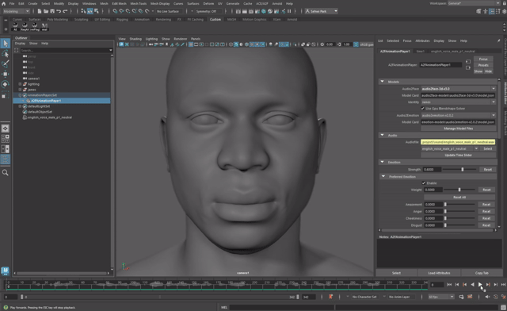
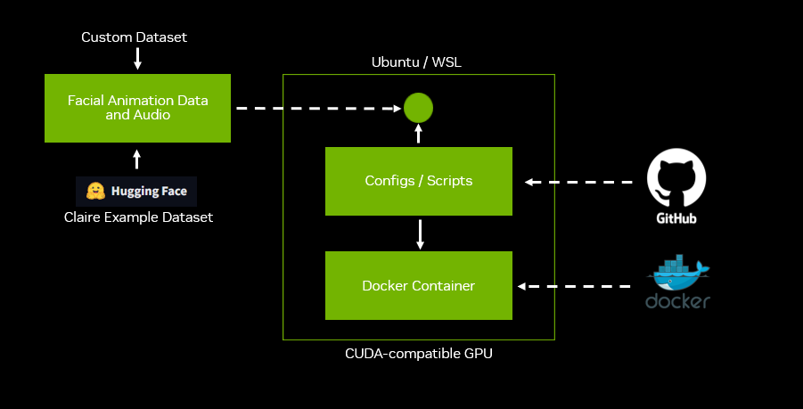

# Introduction

## Audio2Face-3D Models and Integrations

### Audio2Face-3D Evolution

Prior to its release as an open-source project, Audio2Face-3D was shipped with a curated set of pre-trained models. The included package evolved from its initial offering of a single model to a more comprehensive selection of three distinct models, providing users with enhanced flexibility and functionality out of the box.

Audio2Face-3D (A2F) is designed to be extensible, allowing for the integration of additional user-generated models. Any new model that conforms to the architectural specifications of the existing Training Framework can be seamlessly incorporated.

### Animation Inference with Audio2Face-3D
The Audio2Face-3D (A2F) inference engine offers two primary methods for driving facial animation:

**Direct Vertex Manipulation:** The system can directly calculate and apply animation to the vertex positions of a target facial mesh. This method is ideal for workflows that do not rely on traditional rigging systems.

**Blend Shape Weights:** Alternatively, the framework can infer and output a series of blend shape weights. Traditionally, Audio2Face-3D has adopted the Apple ARKit standard to ensure immediate compatibility with a wide variety of facial systems. More info about ARKit on [Apple's developer site](https://developer.apple.com/documentation/arkit/arfaceanchor/blendshapelocation). But this is not limited to ARKit only. Custom blend shapes setups are supported.

**Mapping to Custom Rig Controls:** The blend shape weight values generated by Audio2Face-3D can serve as a powerful intermediary to drive the controls of any custom character rig, including complex systems. Through a strategic mapping process, you can achieve high-quality facial animation on a wide variety of character configurations. A highly effective method for this is to create a set of blend shapes that directly correspond to the controls of your character's rig.

This open architecture, combined with the provided Training Framework, empowers developers and artists to create highly customized facial animation models. This enables the final performance to be tailored to the character personality and custom rig controls.

### What is an Audio2Face-3D Model?

Audio2Face-3D has three pre-trained models: Mark, James, and Claire. They all have their personality and have been trained in different languages. Users can perform inference from those models already.

In essence, when Audio2Face-3D uses a model for inference, it uses a model card (a .json file) and a set of files generated by the Training Framework:

This document provides a comprehensive overview of the model files used by Audio2Face, detailing their generation process within the Training Framework. Once these model files are created and finalized, they can be deployed for inference across the Audio2Face-3D ecosystem.

### Audio2Face-3D Integrations

The Audio2Face-3D inference engine is accessible through several versatile integration points, allowing you to incorporate the technology into a wide range of production pipelines.

* **Maya-ACE Plugin for Autodesk Maya:** A dedicated plugin that enables interactive animation inference directly within the Maya environment. It can load and use any compatible Audio2Face-3D model to drive character rigs.

* **ACE Plugin for Epic's Unreal Engine:** Use our Audio2Face-3D plugin for Unreal Engine 5 alongside a configuration sample to enhance your Metahuman. Audio2Face-3D 3.0 is now available with on-device Unreal Engine 5 support.

* **Audio2Face-3D (A2F) SDK:** A C++ Software Development Kit (SDK) designed for developers to natively integrate the inference engine into custom applications, game engines, or other content creation tools for seamless performance.

* **Audio2Face-3D NIM (NVIDIA Inference Microservice):** A scalable, containerized microservice that exposes the inference functionality through the gRPC protocol. This architecture is ideal for building flexible and high-performance services that can be accessed remotely using various clients, including Python scripts.

&nbsp;&nbsp;&nbsp;&nbsp;&nbsp;&nbsp;&nbsp;&nbsp;&nbsp;&nbsp;

## Training Framework | High Level Overview

The primary goal of the Training Framework is to produce custom deep learning models that the Audio2Face application can use to perform real-time, audio-driven facial animation inference.

From a technical perspective, the Training Framework is designed to run in a Linux environment (**Ubuntu** or **Windows Subsystem for Linux - WSL**) and requires a **CUDA-compatible GPU** for hardware acceleration. This document provides detailed, step-by-step instructions for acquiring all necessary components and correctly configuring the framework.

The major components of the framework and the end-to-end training workflow are illustrated in the diagram below:

The Training Framework is encapsulated within a **Docker container**, which is built locally using the provided Dockerfile.

The operation of this container is orchestrated by a suite of Python scripts and configuration files available in a dedicated **GitHub repository**. These scripts serve as the primary interface, bridging the local animation dataset with the training processes running inside the container.

A critical prerequisite for training is the preparation of a facial animation dataset that adheres to the specific format and directory structure required by the framework. Detailed instructions on how to properly assemble a custom dataset are provided in the [Preparing Animation Data for Training](preparing_animation_data.md) document.

For the container and its scripts to function correctly, the prepared dataset must be copied into the designated directory on the Ubuntu/WSL host system. To facilitate learning and testing, a complete example dataset is available on **Hugging Face**. This resource is highly recommended for verifying your setup and understanding the expected data structure before using your own data.

The ultimate output of the framework is a set of deployable model files. These files contain all the necessary data for the Audio2Face application to perform high-quality facial animation inference based on your custom training data.

The workflow is executed through a series of sequential steps:

1. **Dataset Assembly:** The audio and animation data is collected, formatted, and placed into the correct directory structure as specified in this guide.

2. **Execution via Scripts:** Using the provided Python scripts and configuration files, the core training pipeline is initiated. This process involves sub-steps:
    * **Preprocessing:** The raw dataset is validated and prepared for training.
    * **Training:** The neural network is trained on the preprocessed data.
    * **Deployment:** The trained model is packaged for further use.

3. **TensorRT™ Engine Build:** An NVIDIA TensorRT™ engine needs to be built from the model to optimize it for high-performance, low-latency inference.

4. **Inference:** Once the final model files are generated, they can be used for animation inference via any of the supported Audio2Face-3D integration points, such as the **Maya-ACE plugin**, the **A2F SDK**, or custom scripts leveraging the **Audio2Face NIM**.

***

[Back](../README.md)
