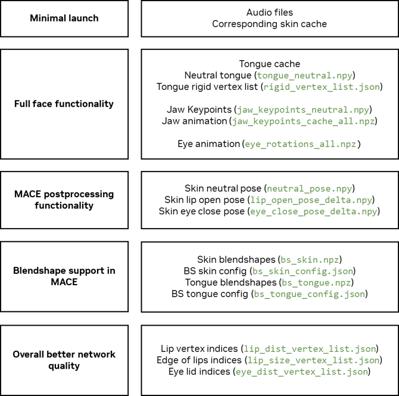

# Audio2Face-3D Training Framework Configurations Guide

This document provides a comprehensive reference for all configuration parameters available in the Audio2Face-3D Training Framework. Each section corresponds to a different configuration file type with detailed parameter descriptions.

We provide the Audio2Face-3D Example Dataset as part of this framework: https://huggingface.co/datasets/nvidia/Audio2Face-3D-Dataset-v1.0.0-claire

## Sections

- [config_dataset.py](#config_datasetpy)
- [config_preproc.py](#config_preprocpy)
- [config_train.py](#config_trainpy)
- [config_inference.py](#config_inferencepy)

## config_dataset.py

This configuration defines paths and properties for the Audio2Face-3D dataset structure.

Some of the input files may be omitted, see picture below for context:

<p align="center">

</p>

### Audio Data

```python
AUDIO_ROOT = {"actor_name": "path/to/audio/directory"}
```
- **Description**: Audio directory containing input audio files in WAV format. Each audio file should correspond to a shot/sequence in your dataset.
- **Use case**: Primary audio source for training and inference. Audio files are preprocessed using either the "nva2f" or "w2v" methods.
- **Format**: Actor-specific dictionary mapping actor names to their audio directories.

### Skin Data

```python
SKIN_CACHE_ROOT = {"actor_name": "path/to/skin/cache"}
```
- **Description**: Directory containing cached skin mesh deformation data for facial animation sequences. These are typically exported from 4D capture or animation software.
- **Use case**: Primary source of facial geometry data for training. Used in PCA decomposition during preprocessing.

```python
SKIN_NEUTRAL_FPATH = {"actor_name": "path/to/neutral.npy"}
```
- **Description**: Path to the neutral facial pose geometry file (NumPy array). Serves as the reference pose for all deformations.
- **Use case**: Used as the mean/center point for PCA decomposition and as reference for delta calculations.

```python
SKIN_NEUTRAL_INFERENCE_FPATH = {"actor_name": "path/to/neutral_inference.npy"}
```
- **Description**: Neutral pose file specifically provided for inference *(Optional, not in sample dataset)*.
- **Use case**: Used during deploy stage to provide neutral face for Maya-ACE.

```python
SKIN_LIP_OPEN_POSE_DELTA_FPATH = {"actor_name": "path/to/lip_open_delta.npy"}
```
- **Description**: Delta pose representing maximum lip opening state relative to neutral pose.
- **Use case**: Used for lip-specific animation controls and constraints during inference.

```python
SKIN_EYE_CLOSE_POSE_DELTA_FPATH = {"actor_name": "path/to/eye_close_delta.npy"}
```
- **Description**: Delta pose representing eye closure state relative to neutral pose.
- **Use case**: Used for eye lid animation controls and constraints during inference.

```python
SKIN_LIP_DIST_VERTEX_LIST_FPATH = {"actor_name": "path/to/lip_dist_vertices.npy"}
```
- **Description**: List of vertex indices defining the lip distance measurement region for lip sync accuracy.
- **Use case**: Used in `LOSS_LIP_DIST_ALPHA` loss computation to enforce proper lip opening/closing during speech.
- **Note**: **One of the most useful ways to control network quality.**

```python
SKIN_LIP_SIZE_VERTEX_LIST_FPATH = {"actor_name": "path/to/lip_size_vertices.npy"}
```
- **Description**: List of vertex indices defining the lip size measurement region.
- **Use case**: Used in `LOSS_LIP_SIZE_ALPHA` loss computation for lip volume consistency.

```python
SKIN_EYE_DIST_VERTEX_LIST_FPATH = {"actor_name": "path/to/eye_dist_vertices.npy"}
```
- **Description**: List of vertex indices defining the eye distance measurement region for eye opening/closing detection.
- **Use case**: Used with `REMOVE_CLOSING_EYE` and `EYE_DIST_THRESHOLD` parameters to filter out eye-closing frames. Only used in regression mode.

### Tongue Data

```python
TONGUE_CACHE_ROOT = {"actor_name": "path/to/tongue/cache"}
```
- **Description**: Directory containing cached tongue mesh deformation data for tongue animation sequences.
- **Use case**: Source of tongue geometry data for training, processed separately from skin data.

```python
TONGUE_NEUTRAL_FPATH = {"actor_name": "path/to/tongue_neutral.npy"}
```
- **Description**: Neutral tongue pose geometry file serving as reference for tongue deformations.
- **Use case**: Used as mean for tongue PCA decomposition and reference for tongue delta calculations.

```python
TONGUE_NEUTRAL_INFERENCE_FPATH = {"actor_name": "path/to/tongue_neutral_inference.npy"}
```
- **Description**: Inference-specific neutral tongue pose file.
- **Use case**: Used in Maya-ACE as a neutral tongue shape.

```python
TONGUE_RIGID_VERTEX_LIST_FPATH = {"actor_name": "path/to/tongue_rigid_vertices.npy"}
```
- **Description**: List of manually selected tongue vertex indices.
- **Use case**: Used to decouple tongue transform deformation.

### Jaw Data

```python
JAW_KEYPOINTS_NEUTRAL_FPATH = {"actor_name": "path/to/jaw_keypoints.npy"}
```
- **Description**: Jaw keypoint positions in neutral state (default shape: 5x3 for 5 keypoints with XYZ coordinates).
- **Use case**: Defines jaw bone positions for jaw rotation and translation animations.

```python
JAW_ANIM_DATA_FPATH = {"actor_name": "path/to/jaw_animation.npz"}
```
- **Description**: Jaw animation data containing jaw movements throughout sequences.
- **Use case**: Target data for jaw channel training and animation generation.

### Eye Data

```python
EYE_ANIM_DATA_FPATH = {"actor_name": "path/to/eye_animation.npz"}
```
- **Description**: Eye animation data containing eye movements and rotations throughout sequences.
- **Use case**: Target data for eye channel training and gaze animation.

```python
EYE_BLINK_KEYS_FPATH = {"actor_name": "path/to/eye_blink_keys.npy"}
```
- **Description**: Eye blink keyframe data (default shape: 10 values).
- **Use case**: Used for generating realistic blinking patterns during animation.

```python
EYE_SACCADE_ROTATIONS_FPATH = {"actor_name": "path/to/saccade_rotations.npy"}
```
- **Description**: Eye saccade rotation data for realistic eye movement patterns (default shape: 5000x2).
- **Use case**: Used for generating natural eye micro-movements during animation.

### Blendshape Data

```python
BLENDSHAPE_SKIN_FPATH = {"actor_name": "path/to/skin_blendshapes.npy"}
```
- **Description**: Skin blendshape targets for facial expression animation.
- **Use case**: Alternative to mesh-based animation, used for blendshape-driven facial animation in Maya-ACE. May be useful for transferring animation to other face meshes.

```python
BLENDSHAPE_SKIN_CONFIG_FPATH = {"actor_name": "path/to/skin_blendshape_config.json"}
```
- **Description**: Configuration file defining blendshape names, weights, and relationships.
- **Use case**: Metadata for interpreting and applying skin blendshapes.

```python
BLENDSHAPE_TONGUE_FPATH = {"actor_name": "path/to/tongue_blendshapes.npy"}
```
- **Description**: Tongue blendshape targets for tongue animation.
- **Use case**: Alternative to mesh-based tongue animation using blendshape system.

```python
BLENDSHAPE_TONGUE_CONFIG_FPATH = {"actor_name": "path/to/tongue_blendshape_config.json"}
```
- **Description**: Configuration file defining tongue blendshape properties.
- **Use case**: Metadata for interpreting and applying tongue blendshapes.

### Dataset Properties

```python
SHOT_EMOTION_NAMES = ["neutral", "happy", "sad", "angry", ...]
```
- **Description**: List of emotion labels used in the training dataset shots.
- **Use case**: Defines the emotion vocabulary for emotion-conditioned animation generation.

```python
SHOT_EMOTION_MAP = [("actor_name", "shot_name", "emotion_name"), ...]
```
- **Description**: Override list for emotion assignments when automatic emotion inference from shot names fails.
- **Use case**: Manual mapping for shots where emotion cannot be inferred from the filename.

```python
CACHE_FPS = {"actor_name": 30.0}
```
- **Description**: Frames-per-second rate for animation caches in the dataset.
- **Use case**: Used for temporal resampling during preprocessing and training. Must be consistent within each actor's data.

```python
ACTOR_NAMES = ["actor1", "actor2", ...]
```
- **Description**: List of actor names performing animations in the dataset.
- **Use case**: Defines the actor vocabulary for multi-actor training and actor-specific processing.
- **Note**: Should be consistent with keys of other configuration parameters represented by dictionaries. Single-actor cases expect one element in the array.

```python
TRANSFORM_SCALE = {"actor_name": {"channel_name": scale_value}}
```
- **Description**: Data transform scaling factors for different animation channels per actor.
- **Use case**: Adjusts data magnitude for numerical stability during training. Some datasets may require scaling adjustments.

## config_preproc.py

This configuration controls the preprocessing pipeline that prepares raw dataset for training.

### Run Configuration

```python
RUN_NAME = "default"
```
- **Description**: Name of the preprocessing run used for organizing output artifacts.
- **Use case**: Use different names for different hyperparameters or datasets to avoid conflicts.

```python
RUN_INFO = "Description of preprocessing run"
```
- **Description**: Additional information describing the preprocessing run, saved to info.txt.
- **Use case**: Documentation for tracking different preprocessing configurations.

### Skin Preprocessing Parameters

```python
SKIN_PRUNE_CACHE_ROOT = {"actor_name": "path/to/low_res_cache"}
```
- **Description**: Path to lower resolution skin cache for memory-efficient preprocessing.
- **Use case**: Reduces memory usage and computation time during PCA pruning by using downsampled data.

```python
SKIN_PRUNE_MESH_MASK_FPATH = {"actor_name": "path/to/prune_mask.npy"}
```
- **Description**: Binary mask defining subset of skin mesh vertices covering only moving parts.
- **Use case**: Reduces computational load by focusing PCA decomposition on deforming regions only.

```python
SKIN_CACHE_SHOTS = {"actor_name": ["shot1", "shot2", ...]}
```
- **Description**: List of shots to include in skin preprocessing. If missing, uses all shots in directory.
- **Use case**: Selective processing for dataset subsets or excluding problematic shots.

```python
SKIN_PRUNE_CACHE_SHOTS = {"actor_name": ["shot1", "shot2", ...]}
```
- **Description**: List of shots to use with pruned cache data.
- **Use case**: Must match shots available in SKIN_PRUNE_CACHE_ROOT.

```python
SKIN_FORCE_COMPONENTS = {"actor_name": 150}
```
- **Description**: Force specific number of PCA components instead of using variance threshold.
- **Use case**: Manual control over PCA dimensionality when automatic selection is unsatisfactory.

```python
SKIN_PRUNE_SIM_DIST = 4.0
```
- **Description**: Distance threshold for pose similarity during pruning.
- **Use case**: Controls how similar poses must be to be considered duplicates during dataset pruning.

```python
SKIN_SELECT_DISTINCT_MAX_ITER = 787
```
- **Description**: Maximum iterations for distinct pose selection algorithm.
- **Use case**: Prevents infinite loops in pose selection while ensuring good coverage.

```python
SKIN_PCA_VARIANCE_THRESHOLD = 0.9995
```
- **Description**: Variance threshold for automatic PCA component selection (99.95% variance retention).
- **Use case**: Higher values preserve more detail but increase model complexity.

### Tongue Preprocessing Parameters

```python
TONGUE_CACHE_SHOTS = {"actor_name": ["shot1", "shot2", ...]}
```
- **Description**: List of shots to include in tongue preprocessing.
- **Use case**: Selective processing for tongue animation data.

```python
TONGUE_FORCE_COMPONENTS = {"actor_name": 10}
```
- **Description**: Force specific number of tongue PCA components.
- **Use case**: Manual control over tongue PCA dimensionality.

```python
TONGUE_PCA_VARIANCE_THRESHOLD = 0.9995
```
- **Description**: Variance threshold for tongue PCA component selection.
- **Use case**: Controls the trade-off between tongue animation quality and model complexity.

### Default Artifact Dimensions

```python
DEFAULT_JAW_KEYPOINTS_SHAPE = (5, 3)
```
- **Description**: Default shape for jaw keypoints if no data provided (5 keypoints, XYZ coordinates).
- **Use case**: Fallback when jaw data is missing from the dataset.

```python
DEFAULT_EYE_BLINK_KEYS_SHAPE = (10,)
```
- **Description**: Default shape for eye blink keys if no data provided.
- **Use case**: Fallback for eye animation when blink data is missing.

```python
DEFAULT_EYE_SACCADE_ROT_SHAPE = (5000, 2)
```
- **Description**: Default shape for eye saccade rotations (5000 samples, 2D rotations).
- **Use case**: Fallback for eye micro-movements when saccade data is missing.

```python
DEFAULT_TONGUE_PCA_SHAPE = (10, 520, 3)
```
- **Description**: Default shape for tongue PCA if no data provided (10 components, 520 vertices, XYZ).
- **Use case**: Fallback when tongue data is missing from the dataset.

### Output Configuration

```python
PREPROC_OUTPUT_ROOT = "/workspace/output_preproc"
```
- **Description**: Root directory for writing preprocessing artifacts.
- **Use case**: Centralized location for all preprocessing outputs.

```python
VERBOSE = False
```
- **Description**: Enable verbose logging during preprocessing.
- **Use case**: Detailed debugging information for preprocessing issues.

## config_train.py

This configuration controls the neural network training process.

### Run Configuration

```python
RUN_NAME = "default"
```
- **Description**: Name of the training run for organizing outputs and artifacts.
- **Use case**: Use different names for different hyperparameters, datasets, or experiments.

```python
RUN_INFO = "Description of training run"
```
- **Description**: Additional information about the training run, saved to info.txt.
- **Use case**: Documentation for experiment tracking and result interpretation.

```python
NETWORK_VERSION = "0.1"
```
- **Description**: Version number for the final trained network artifact stored in network_info.json.
- **Use case**: Version tracking for model deployment and compatibility.

```python
NETWORK_TYPE = "regression"
```
- **Description**: Type of network architecture (regression vs diffusion).
- **Use case**: Determines which training pipeline and loss functions to use.

### Preprocessing Artifacts

```python
PREPROC_ROOT = "/workspace/output_preproc"
```
- **Description**: Root directory containing preprocessing artifacts to read.
- **Use case**: Must match the artifact location from the preprocessing step.

```python
PREPROC_RUN_NAME_FULL = {"actor_name": "preproc_run_name_timestamp"}
```
- **Description**: Full name of preprocessing run directory containing artifacts for each actor.
- **Use case**: Links training to specific preprocessing outputs. Set this after running preprocessing.

```python
SKIN_PCA_COEFFS_FPATH = {"actor_name": "path/to/skin_pca_coeffs.npz"}
```
- **Description**: Override path to skin PCA coefficients file. If missing, auto-resolved from PREPROC_ROOT.
- **Use case**: Manual path specification when using custom preprocessing artifact locations.

```python
SKIN_PCA_SHAPES_FPATH = {"actor_name": "path/to/skin_pca_shapes.npz"}
```
- **Description**: Override path to skin PCA shapes/basis vectors file.
- **Use case**: Manual path specification for skin PCA basis vectors.

```python
TONGUE_PCA_COEFFS_FPATH = {"actor_name": "path/to/tongue_pca_coeffs.npz"}
```
- **Description**: Override path to tongue PCA coefficients file.
- **Use case**: Manual path specification for tongue PCA coefficients.

```python
TONGUE_PCA_SHAPES_FPATH = {"actor_name": "path/to/tongue_pca_shapes.npz"}
```
- **Description**: Override path to tongue PCA shapes/basis vectors file.
- **Use case**: Manual path specification for tongue PCA basis vectors.

```python
DATA_INFO_FPATH = {"actor_name": "path/to/data_info.json"}
```
- **Description**: Override path to data information metadata file.
- **Use case**: Contains dataset statistics and preprocessing parameters.

```python
SHOT_LIST_FPATH = {"actor_name": "path/to/shot_list.json"}
```
- **Description**: Override path to shot list file containing available shots and metadata.
- **Use case**: Defines which shots are available for training.

### Dataset Sampling

```python
TARGET_CHANNELS = ["skin_coeffs", "tongue_coeffs", "jaw", "eye"]
```
- **Description**: List of animation channels to include in training targets.
- **Options**: skin_coeffs, tongue_coeffs, jaw, eye, skin_pose, tongue_pose
- **Use case**: Controls which aspects of facial animation the model learns. The skin_coeffs/tongue_coeffs options use PCA representation for efficiency. Diffusion models typically use pose (absolute) representation.
- **Note**: Regression models default to PCA coefficients while diffusion models default to absolute poses.

```python
TARGET_FPS = 30.0
```
- **Description**: Target frames-per-second for training animation. Ground-truth caches are resampled to this rate.
- **Use case**: Must be an integer multiple of the original cache FPS.

```python
RESCALE_TARGET_CHANNEL_DATA = False
```
- **Description**: Whether to rescale target channel data for normalization.
- **Use case**: May improve training stability for datasets with large value ranges.
- **Note**: Default is False for regression models and True for diffusion models.

```python
AUDIO_PREPROC_METHOD = "w2v"
```
- **Description**: Audio preprocessing method for feature extraction.
- **Options**: "nva2f" (normalize and resample), "w2v" (Compatible with Wav2Vec-based features)
- **Use case**: The "w2v" method typically provides better audio-visual synchronization quality.

```python
AUDIO_PARAMS = {"buffer_len": 8320, "buffer_ofs": 8320 // 2, "samplerate": 16000}
```
- **Description**: Audio processing parameters for training.
- **buffer_len**: Audio buffer length in samples for each frame
- **buffer_ofs**: Buffer offset for temporal alignment
- **samplerate**: Target audio sampling rate
- **Use case**: Defines temporal window and resolution for regression training and inference.

### Dataset Clips

```python
CLIPS = [("actor_name", "shot_name", (start_frame, end_frame), "speaker_name", "language", "audio_file.wav", audio_offset)]
```
- **Description**: List of training clips with audio-visual alignment information.
- **Format**: (actor_name, shot_name, (clip_first_frame, clip_last_frame), speaker_name, audio_lang, audio_fpath_rel, audio_offset)
- **Use case**: Defines exact training data segments. Multiple clips can reference the same shot with different ranges or audio tracks.

### Dataset Augmentation

```python
AUGMENT = {"timeshift": 1.0}
```
- **Description**: Data augmentation parameters for training robustness.
- **timeshift**: Random temporal shifting range in frames
- **pitch_shift**: Audio pitch modification parameters (used in diffusion models)
- **Use case**: Improves model generalization by adding controlled variations to the training data.
- **Note**: Regression models use timeshift augmentation by default, while diffusion models use pitch_shift augmentation.

```python
AUG_MUTED_SHOTS = [("actor_name", ("source_shot", source_frame), muted_length, "emotion")]
```
- **Description**: Data augmentation with synthetically generated muted shots for training on non-speech content.
- **Format**: (actor_name, (source_shot_name, source_shot_frame), muted_shot_len, shot_emotion_name)
- **Purpose**: Helps the model learn the purely visual characteristics of an emotional expression, independent of any vocal cues.
- **Implementation**:
  - Each element represents a synthetically generated animation sequence
  - The system captures a static facial expression from the specified `source_shot_name` at `source_shot_frame`
  - Generates an animation sequence that is `muted_shot_len` frames long
  - Tags the sequence with `shot_emotion_name` for emotion conditioning
  - Creates corresponding synthetic audio with microphone background noise to match the animation sequence
- **Use case**: Teaches the model to maintain consistent facial expressions during silence periods for specific emotions.
- **Note**: This is a training-time augmentation feature. You don't need to prepare muted shots in your dataset; they are generated synthetically. See [Preparing Animation Data](preparing_animation_data.md) for dataset preparation requirements.

```python
AUG_MUTED_SKIN_IS_NEUTRAL_FOR_NEUTRAL_EMO = True
```
- **Description**: Whether muted shots with neutral emotion use neutral skin pose.
- **Use case**: Ensures a consistent neutral expression during silent periods.

```python
AUG_MUTED_TONGUE_IS_NEUTRAL = False
```
- **Description**: Whether muted shots always use neutral tongue pose.
- **Use case**: Controls tongue behavior during silence.

```python
AUG_MUTED_AUDIO_NOISE_TYPE = "mic"
```
- **Description**: Type of audio noise to add to muted shots.
- **Options**: None, "gauss", "mic"
- **Use case**: The "mic" option simulates realistic microphone noise for more robust training.

```python
AUG_MUTED_AUDIO_NOISE_SCALE = 0.1
```
- **Description**: Global scaling factor for audio noise in muted shots.
- **Use case**: Controls overall noise intensity.

```python
AUG_MUTED_AUDIO_NOISE_LOCAL_SCALE_RANGE = (0.0, 1.0)
```
- **Description**: Range for local noise scaling variations.
- **Use case**: Adds temporal variation to noise intensity.

### Network Architecture

```python
NETWORK_NAME = "conv_w2v_autocorr"
```
- **Description**: Name of the network architecture to use for training.
- **Use case**: Determines which network class is instantiated. Must match available network implementations.

```python
NETWORK_HYPER_PARAMS = {...}
```
- **Description**: Hyperparameters specific to the chosen network architecture.
- **use_w2v_features**: Whether to use Wav2Vec audio features
- **use_autocorr_features**: Whether to use autocorrelation audio features
- **w2v_freeze**: Whether to freeze Wav2Vec weights during training
- **autocorr_params**: Parameters for autocorrelation feature extraction
- **implicit_emotion_len**: Dimension of implicit emotion embeddings
- **explicit_emo_emb_len**: Dimension of explicit emotion embeddings
- **Use case**: Controls network capacity, feature usage, and emotion modeling.

```python
PRETRAINED_NET_FPATH = None
```
- **Description**: Path to pretrained network weights for initialization or fine-tuning.
- **Use case**: Enables transfer learning or continued training from previous checkpoints.

### Training Parameters

```python
BATCH_SIZE = 32
```
- **Description**: Number of training samples processed simultaneously.
- **Use case**: Larger batches provide more stable gradients but require more memory. Diffusion models currently only support batch size 1.
- **Note**: Diffusion models are constrained to batch size 1 due to their architecture.

```python
NUM_EPOCHS = 50
```
- **Description**: Number of complete passes through the training dataset.
- **Use case**: More epochs can improve learning but may cause overfitting.

```python
LEARNING_RATE = 0.001 * 0.2
```
- **Description**: Base learning rate for the optimizer.
- **Use case**: Controls training speed and stability. Too high causes instability, too low causes slow convergence.

```python
LR_STEP_GAMMA = 0.994
```
- **Description**: Learning rate decay factor applied each step/epoch.
- **Use case**: Gradual learning rate reduction for training stabilization.

### Loss Function Weights

```python
LOSS_MSE_ALPHA = 1.0
```
- **Description**: Weight for mean squared error loss between predicted and target animations.
- **Use case**: Primary reconstruction loss ensuring prediction accuracy.

```python
LOSS_MOTION_ALPHA = 10.0
```
- **Description**: Weight for motion loss enforcing temporal smoothness.
- **Use case**: Prevents jittery animations by penalizing large frame-to-frame changes.

```python
LOSS_EMO_REG_ALPHA = 1.0
```
- **Description**: Weight for emotion regularization loss.
- **Use case**: Prevents emotion embeddings from growing too large or changing too rapidly.

```python
LOSS_LIP_DIST_ALPHA = 100.0
```
- **Description**: Weight for lip distance loss enforcing proper lip sync.
- **Use case**: Strong supervision for lip opening/closing based on audio content. Critical for lip sync quality.

```python
LOSS_LIP_DIST_EXP = 1.0
```
- **Description**: Exponent for lip distance loss calculation.
- **Use case**: Controls loss function shape - higher values emphasize larger errors more strongly.

```python
LOSS_LIP_DIST_EMO_WEIGHTS = None
```
- **Description**: Per-emotion weights for lip distance loss.
- **Use case**: Can emphasize lip sync accuracy for specific emotions if needed.

```python
LOSS_LIP_SIZE_ALPHA = None
```
- **Description**: Weight for lip size consistency loss (disabled if None).
- **Use case**: Enforces consistent lip shape when enabled.

```python
LOSS_LIP_SIZE_EMO_WEIGHTS = None
```
- **Description**: Per-emotion weights for lip size loss.
- **Use case**: Emotion-specific lip size control when enabled.

```python
LOSS_VOL_STAB_REG_ALPHA = 1e2
```
- **Description**: Weight for volume stabilization regularization loss.
- **Use case**: Prevents unrealistic volume changes in facial geometry.

```python
LOSS_VOL_STAB_REG_EXP = 5000.0
```
- **Description**: Exponent for volume stabilization loss.
- **Use case**: Controls sensitivity to volume variations.

### Output Configuration

```python
TRAIN_OUTPUT_ROOT = "/workspace/output_train"
```
- **Description**: Root directory for training outputs (logs, checkpoints, etc.).
- **Use case**: Centralized location for all training artifacts.

```python
FINAL_DEPLOY_ROOT = "/workspace/output_deploy"
```
- **Description**: Directory for final deployment artifacts after training completion.
- **Use case**: Location for finalized models ready for inference deployment.

```python
TORCH_CACHE_ROOT = "/workspace/torch_cache"
```
- **Description**: Directory for PyTorch cache files (model downloads, etc.).
- **Use case**: Persistent cache location for avoiding repeated downloads.

### Emotion Configuration

```python
SHOT_EMOTION_NAME_FOR_ALL_ZEROS = "neutral"
```
- **Description**: Emotion name that maps to zero vector in emotion input.
- **Use case**: Defines reference emotion for neutral expression baseline.

```python
DEFAULT_SHOT_EMOTION_NAME = "neutral"
```
- **Description**: Default emotion for network_info.json and fallback cases.
- **Use case**: Reference emotion for model deployment configuration.

### Logging and Reproducibility

```python
LOG_PERIOD = 50
```
- **Description**: Number of training steps between logging updates.
- **Use case**: Controls logging frequency - smaller values provide more detailed monitoring.

```python
REPRODUCIBLE = True
```
- **Description**: Whether to enable reproducible training with fixed random seeds.
- **Use case**: Ensures identical results across runs for debugging and comparison.

```python
RNG_SEED_TORCH = 42
```
- **Description**: Random seed for PyTorch operations.
- **Use case**: Fixed seed for reproducible PyTorch computations.

```python
RNG_SEED_DATASET = 43
```
- **Description**: Random seed for dataset operations (shuffling, augmentation, etc.).
- **Use case**: Fixed seed for reproducible data loading and augmentation.

### Caching Configuration

```python
AUDIO_DATA_CACHING = True
```
- **Description**: Whether to cache loaded audio data in memory.
- **Use case**: Improves training speed by avoiding repeated file I/O, but increases memory usage.

```python
TARGET_DATA_CACHING = True
```
- **Description**: Whether to cache target animation data in memory.
- **Use case**: Improves training speed but requires sufficient RAM for dataset.

```python
TARGET_OBJECTS_TO_CUDA = True
```
- **Description**: Whether to move cached target objects directly to GPU memory.
- **Use case**: Further speeds up training by avoiding CPU-GPU transfers.

### Regression-Specific Training Parameters

```python
SEQ_LEN = 2
```
- **Description**: Sequence length for regression model training (number of frames per training sample).
- **Use case**: Longer sequences capture more temporal context but increase memory usage.
- **Note**: This parameter is only available in regression models; diffusion models use variable-length sequences.

```python
SEQ_STRIDE = 1
```
- **Description**: Stride between consecutive training sequences.
- **Use case**: Smaller stride increases training data overlap but may cause overfitting.
- **Note**: This parameter is only available in regression models; diffusion models use variable-length sequences.

```python
REMOVE_CLOSING_EYE = True
```
- **Description**: Whether to mask out eye-closing frames during training.
- **Use case**: Prevents model from learning to close eyes inappropriately during speech.
- **Note**: This parameter is only available in regression models, not applicable to diffusion models.

```python
EYE_DIST_THRESHOLD = 0.35
```
- **Description**: Distance threshold for detecting eye closure (used with REMOVE_CLOSING_EYE).
- **Use case**: Lower values are more strict about eye closure detection.
- **Units**: Absolute units in 3D space
- **Note**: This parameter is only available in regression models, not applicable to diffusion models.

```python
EMO_INIT_SIGMA = 0.01
```
- **Description**: Standard deviation for emotion embedding initialization.
- **Use case**: Controls initial emotion embedding magnitudes for stable training.
- **Note**: This parameter is only available in regression models for implicit emotion embedding initialization.

```python
PHONEME_FORCING_LANGS = ["en"]
```
- **Description**: Languages for which to enable phoneme-based training supervision.
- **Use case**: Improves lip-sync accuracy by providing phoneme-level guidance.
- **Note**: This parameter is only available in regression models with phoneme supervision enabled.

```python
PHONEME_PROB_TEMPERATURE = 1.0
```
- **Description**: Temperature parameter for phoneme probability distribution during training.
- **Use case**: Controls sharpness of phoneme predictions. Higher values = softer distributions.
- **Note**: This parameter is only available in regression models with phoneme supervision enabled.

```python
EMO_LR_MULT = 1.0
```
- **Description**: Learning rate multiplier for implicit emotion-related parameters.
- **Use case**: Allows different learning rates for implicit emotion vs. other parameters.
- **Note**: This parameter is only available in regression models.

```python
LOSS_PHONEME_ALPHA = 0.1
```
- **Description**: Weight for phoneme prediction loss.
- **Use case**: Provides phoneme-level supervision for improved lip sync by training a separate detachable phoneme predicting head.
- **Note**: This parameter is only available in regression models with phoneme supervision enabled.

```python
LOSS_PHONEME_SIL_WEIGHT = 1.0
```
- **Description**: Weight for silence phoneme in phoneme loss.
- **Use case**: Controls how much the model focuses on silent periods.
- **Note**: This parameter is only available in regression models with phoneme supervision enabled.

```python
LOSS_PHONEME_MOTION_ALPHA = 0.05
```
- **Description**: Weight for phoneme motion consistency loss.
- **Use case**: Ensures smooth transitions between phoneme-driven expressions.
- **Note**: This parameter is only available in regression models with phoneme supervision enabled.

```python
COMPACTIFY_IMPLICIT_EMO_DB = False
```
- **Description**: Whether to compress implicit emotion database for memory efficiency.
- **Use case**: Reduces memory usage for large datasets at potential quality cost.
- **Note**: This parameter is only available in regression models.

```python
PHONEME_DATA_CACHING = True
```
- **Description**: Whether to cache phoneme data in memory.
- **Use case**: Speeds up phoneme-based training at the cost of memory.

### Diffusion-Specific Training Parameters

```python
MEAN_GEOMETRY_FPATH = {"actor_name": "path/to/mean_geometry.npy"}
```
- **Description**: Override path to mean geometry template file for diffusion models. Contains the combined and normalized mean geometry (skin, tongue, jaw, eyes)
- **Use case**: Provides the reference "neutral" geometry from which animation deltas are predicted. Auto-generated during preprocessing deployment.
- **Note**: This parameter is only available in diffusion configs. If missing for an actor, auto-resolved from PREPROC_ROOT and PREPROC_RUN_NAME_FULL.

```python
TRAIN_ON_RANDOM_SUBSEGMENT = True
```
- **Description**: Whether to train on random segments of tracks rather than fixed sequences.
- **Use case**: Improves training diversity and helps with variable-length sequence handling.

```python
SUBSEGMENT_MIN_FRAME = 30
```
- **Description**: Minimum length for random training segments (in frames).
- **Use case**: Ensures sufficient temporal context for meaningful animation learning.

```python
SUBSEGMENT_MAX_FRAME = 600
```
- **Description**: Maximum length for random training segments (in frames).
- **Use case**: Prevents memory issues while allowing long sequence training.

```python
AUDIO_PARAMS = {"buffer_len": 16000, "padding_left": 16000, "padding_right": 16000, "samplerate": 16000}
```
- **Description**: Audio processing parameters optimized for diffusion training.
- **Use case**: Different buffering strategy with padding for better temporal modeling.

```python
NO_STANDARDIZE_AUDIO = True
```
- **Description**: Disables audio standardization for diffusion training.
- **Use case**: Preserves audio signal characteristics important for diffusion conditioning.
- **Note**: This parameter is only available in diffusion models.

```python
NETWORK_NAME = "diffusion_rnn"
```
- **Description**: Specifies RNN-based diffusion network architecture.
- **Use case**: Combines recurrent temporal modeling with diffusion generation.

```python
NETWORK_HYPER_PARAMS = {
    "feature_dim": 256,
    "jaw_latent_dim": 15,
    "tongue_latent_dim": 10,
    "eye_latent_dim": 4,
    "gru_feature_dim": 256,
    "num_gru_layers": 2,
    "emo_embedding_dim": 32,
    "actor_embedding_dim": 32,
    "hubert_feature_dim": 768,
}
```
- **Description**: Architecture parameters for diffusion RNN network.
- **Use case**: Controls model capacity and specialization for different facial components.

```python
DIFFUSION_STEPS = 1000
```
- **Description**: Number of diffusion steps in the forward/reverse process.
- **Use case**: More steps provide higher quality but slower generation. Standard value for good quality.

```python
DIFFUSION_NOISE_SCHEDULE = "cosine"
```
- **Description**: Noise schedule type for diffusion process.
- **Options**: "linear", "cosine", etc.
- **Use case**: "cosine" typically provides better training stability and generation quality.

```python
TIMESTEP_RESPACING = ""
```
- **Description**: Timestep respacing configuration for inference speedup.
- **Use case**: Can reduce inference steps while maintaining quality when properly configured.

```python
STREAMING_CFG = {
    "60": {"audio_pad_left": 16000, "audio_pad_right": 16000, "window_size": 16000, "left_truncate": 15, "right_truncate": 15, "block_frame_size": 30},
    "30": {"audio_pad_left": 16000, "audio_pad_right": 16000, "window_size": 16000, "left_truncate": 7, "right_truncate": 8, "block_frame_size": 15}
}
```
- **Description**: Configuration for streaming inference at different frame rates.
- **Use case**: Enables real-time inference with proper buffering and latency control.

```python
GRADIENT_ACCUMULATION_STEPS = 4
```
- **Description**: Number of forward passes before gradient update.
- **Use case**: Simulates larger batch size while respecting memory constraints.
- **Note**: Only available in diffusion models to compensate for batch size 1 limitation.

```python
LOSS_VELOCITY_ALPHA = 0.0
```
- **Description**: Weight for frame-to-frame motion consistency loss on predicted vs ground truth velocity.
- **Use case**: Enforces temporal motion accuracy by matching predicted frame differences to ground truth motion vectors.

```python
LOSS_EXP_SMOOTH_ALPHA = 25.0
```
- **Description**: Weight for upper face temporal smoothing regularization loss.
- **Use case**: Reduces jitter in upper face regions by penalizing large frame-to-frame changes using a soft mask.

```python
TONGUE_WEIGHT = 0.1
```
- **Description**: Relative weight for tongue components in diffusion loss.
- **Use case**: Balances importance of tongue vs. face animation during training.

```python
JAW_WEIGHT = 1.0
```
- **Description**: Relative weight for jaw components.
- **Use case**: Controls importance of jaw animation in training.

## config_inference.py

Upon completion of the training process, the `run_deploy.py` deployment script packages all the necessary components into a ready-to-use format. The resulting collection of files represents the complete model configuration required by the inference engine.

The primary model configuration file `model_config_<actor name>.json` is human-readable and can be manually edited after deployment. This allows for the fine-tuning of various inference parameters without needing to retrain the model. This configuration controls default post-processing parameters for Maya-ACE inference. These parameters are almost identical for diffusion and regression networks, except for `source_shot` and `source_frame` parameters which are only available in regression models.

```python
CONFIG = {
    "input_strength": 1.3,
    "upper_face_smoothing": 0.001,
    "lower_face_smoothing": 0.0023,
    "upper_face_strength": 1.0,
    "lower_face_strength": 1.7,
    "face_mask_level": 0.6,
    "face_mask_softness": 0.0085,
    "source_shot": None,
    "source_frame": None,
    "skin_strength": 1.1,
    "blink_strength": 1.0,
    "lower_teeth_strength": 1.3,
    "lower_teeth_height_offset": -0.1,
    "lower_teeth_depth_offset": 0.25,
    "lip_open_offset": -0.05,
    "tongue_strength": 1.5,
    "tongue_height_offset": 0.2,
    "tongue_depth_offset": -0.3,
    "eyeballs_strength": 1.0,
    "saccade_strength": 0.9,
    "right_eye_rot_x_offset": 0.0,
    "right_eye_rot_y_offset": -2.0,
    "left_eye_rot_x_offset": 0.0,
    "left_eye_rot_y_offset": 2.0,
    "eyelid_open_offset": 0.06,
    "eye_saccade_seed": 0,
}
```

### Global Control Parameters

```python
"input_strength": 1.3
```
- **Description**: Global multiplier for input audio signal strength.
- **Use case**: Adjust overall responsiveness of facial animation to audio. Higher values increase animation intensity.

### Face Region Control

```python
"upper_face_smoothing": 0.001
```
- **Description**: Temporal smoothing factor for upper face region (forehead, brows).
- **Use case**: Reduces jitter in upper face animation. Higher values increase smoothing.

```python
"lower_face_smoothing": 0.0023
```
- **Description**: Temporal smoothing factor for lower face region (mouth, jaw, cheeks).
- **Use case**: Smooths lower face animation while preserving lip sync detail.

```python
"upper_face_strength": 1.0
```
- **Description**: Animation strength multiplier for upper face region.
- **Use case**: Controls intensity of upper face expressions and movements.

```python
"lower_face_strength": 1.7
```
- **Description**: Animation strength multiplier for lower face region.
- **Use case**: Often higher than upper face to emphasize speech-related movements.

```python
"face_mask_level": 0.6
```
- **Description**: Blending level for face mask.
- **Use case**: Defines boundary between lower and upper facial regions.

```python
"face_mask_softness": 0.0085
```
- **Description**: Softness of face mask blending boundaries.
- **Use case**: Prevents hard transitions between lower and upper regions.

### Reference Frame Control

```python
"source_shot": None
```
- **Description**: Source shot name for reference frame.
- **Use case**: Specifies which shot to use as reference for regression model prediction.
- **Note**: This parameter is only available for regression models, not diffusion models.

```python
"source_frame": None
```
- **Description**: Source frame number for reference pose.
- **Use case**: Specifies which frame within source shot to use as reference.
- **Note**: This parameter is only available for regression models, not diffusion models.

### Component Strength Control

```python
"skin_strength": 1.1
```
- **Description**: Animation strength multiplier for skin/face deformation.
- **Use case**: Controls overall facial animation intensity.

```python
"blink_strength": 1.0
```
- **Description**: Animation strength multiplier for eye blinking.
- **Use case**: Adjusts intensity of automatic blinking animation.

### Teeth Animation Control

```python
"lower_teeth_strength": 1.3
```
- **Description**: Animation strength multiplier for lower teeth movement.
- **Use case**: Controls how much lower teeth follow jaw movement.

```python
"lower_teeth_height_offset": -0.1
```
- **Description**: Vertical offset for lower teeth position.
- **Use case**: Fine-tunes lower teeth vertical alignment relative to jaw.

```python
"lower_teeth_depth_offset": 0.25
```
- **Description**: Depth offset for lower teeth position.
- **Use case**: Adjusts forward/backward position of lower teeth.

### Lip Animation Control

```python
"lip_open_offset": -0.05
```
- **Description**: Offset for lip opening amount (negative closes lips slightly).
- **Use case**: Fine-tunes default lip separation for better lip sync.

### Tongue Animation Control

```python
"tongue_strength": 1.5
```
- **Description**: Animation strength multiplier for tongue movement.
- **Use case**: Controls intensity of tongue animation during speech.

```python
"tongue_height_offset": 0.2
```
- **Description**: Vertical offset for tongue position.
- **Use case**: Adjusts tongue height relative to mouth interior.

```python
"tongue_depth_offset": -0.3
```
- **Description**: Depth offset for tongue position.
- **Use case**: Adjusts forward/backward tongue position in mouth.

### Eye Animation Control

```python
"eyeballs_strength": 1.0
```
- **Description**: Animation strength multiplier for eyeball movement.
- **Use case**: Controls intensity of eye gaze animation.

```python
"saccade_strength": 0.9
```
- **Description**: Animation strength multiplier for eye saccade micro-movements.
- **Use case**: Controls intensity of natural eye micro-movements.

```python
"right_eye_rot_x_offset": 0.0
```
- **Description**: X-axis rotation offset for right eye.
- **Use case**: Corrects eye alignment or adds intentional eye direction bias.

```python
"right_eye_rot_y_offset": -2.0
```
- **Description**: Y-axis rotation offset for right eye.
- **Use case**: Adjusts right eye horizontal gaze direction.

```python
"left_eye_rot_x_offset": 0.0
```
- **Description**: X-axis rotation offset for left eye.
- **Use case**: Corrects left eye vertical alignment.

```python
"left_eye_rot_y_offset": 2.0
```
- **Description**: Y-axis rotation offset for left eye.
- **Use case**: Adjusts left eye horizontal gaze direction (often opposite to right eye).

```python
"eyelid_open_offset": 0.06
```
- **Description**: Offset for eyelid opening amount.
- **Use case**: Fine-tunes default eyelid position - larger values open eyes more.

```python
"eye_saccade_seed": 0
```
- **Description**: Random seed for eye saccade generation.
- **Use case**: Controls deterministic vs random eye micro-movements.

### Diffusion Inference Parameters

Python inference is implemented only for diffusion models, these parameters are used to control python inference.

```python
CONDITION = None
```
- **Description**: Which actor's facial behavior to use during inference.
- **Use case**: Most frequently, `CONDITION` and `ACTOR_NAME` are the same.

```python
ACTOR_NAME = None
```
- **Description**: Target actor for diffusion inference.
- **Use case**: Specifies which actor's base face to use for generation.

```python
EMOTION_LABEL = None
```
- **Description**: Target emotion label.
- **Use case**: Controls emotional expression during inference.

```python
TIMESTEP_RESPACING = None
```
- **Description**: Timestep respacing for faster diffusion inference.
- **Use case**: Reduces inference time by using fewer diffusion steps.

```python
AUDIO_PATH = None
```
- **Description**: Path to input audio file for inference.
- **Use case**: Specifies which audio file to process during inference.

### Diffusion Process Control

```python
NUM_DIFFUSION_STEPS = 2
```
- **Description**: Number of diffusion steps for inference (much lower than training's 1000).
- **Use case**: Trades generation quality for speed. Adjust based on quality/speed requirements.

```python
SKIP_STEPS = 0
```
- **Description**: Number of initial diffusion steps to skip.
- **Use case**: Can further speed up inference by starting from partially denoised state.

```python
USE_DDIM = False
```
- **Description**: Whether to use DDIM (Denoising Diffusion Implicit Models) sampling.
- **Use case**: DDIM can provide faster inference with deterministic sampling.

```python
USE_PER_FRAME_EMO_LABEL = True
```
- **Description**: Whether to use per-frame emotion labels during inference. Used for ONNX export configuration.
- **Use case**: Enables frame-by-frame emotion control for more dynamic facial expressions.

```python
USE_EXTERNAL_NOISE_INPUT = True
```
- **Description**: Whether to accept noise as input for reproducible inference. Used for ONNX export configuration.
- **Use case**: Allows external control of noise patterns for deterministic generation results.

```python
USE_DELTA_OUTPUT = True
```
- **Description**: Whether to output position delta (in original scale) or the absolute position. Used for ONNX export configuration.
- **Use case**: Controls output format - delta values for changes relative to mean shape or absolute positions for direct mesh control.

```python
INFERENCE_MODE = None
```
- **Description**: Specific inference mode for diffusion generation.
- **Use case**: May specify different sampling strategies or optimizations.

```python
DETERMINISTIC_NOISE_PATH = None
```
- **Description**: Path to deterministic noise for reproducible generation.
- **Use case**: Enables reproducible inference results by using fixed noise patterns.

### Output Configuration

```python
INFERENCE_OUTPUT_ROOT = "/workspace/output_inference"
```
- **Description**: Root directory for inference output files.
- **Use case**: Centralized location for all inference results.

```python
OUTPUT_MAYA_CACHE = True
```
- **Description**: Whether to output animation in Maya cache format.
- **Use case**: Enables direct import into Autodesk Maya for further editing or rendering.

```python
OUTPUT_NPY_FILE = False
```
- **Description**: Whether to output raw NumPy arrays of animation data.
- **Use case**: Provides direct access to numerical animation data for custom processing.

## Usage Notes

1. **Actor-specific parameters**: Many parameters use dictionary format `{"actor_name": value}` to support multi-actor datasets.

2. **Path resolution**: When actor-specific paths are missing, the system typically auto-resolves them from root directories and run names.

3. **Parameter validation**: The system validates parameter compatibility during runtime and will error on invalid combinations.

4. **Memory considerations**: Caching parameters significantly affect memory usage. Disable caching if running into memory issues.

5. **Quality vs. speed trade-offs**: Many parameters involve trade-offs between animation quality and processing speed. Adjust based on your specific requirements.

6. **Model type consistency**: Don't mix regression and diffusion parameters - use the appropriate config type for your chosen model architecture.

***

[Back](../README.md)
