# Preparing Animation Data for Training

## What is a Training Dataset?

At a high level, a training dataset consists of a corpus of high-fidelity facial animation shots precisely synchronized with their corresponding audio recordings.

&nbsp;&nbsp;&nbsp;&nbsp;&nbsp;&nbsp;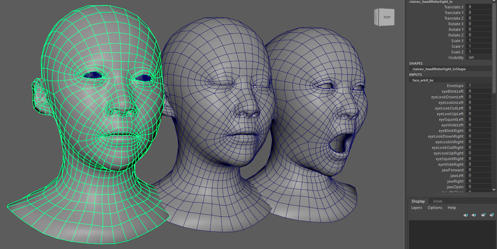

The animation must be compatible with standard Digital Content Creation (DCC) applications such as Autodesk Maya, Autodesk 3ds Max or Blender so that it can be exported to the format required by the Training Framework.

The framework distinguishes between **shots** (complete animation sequences captured or created in your DCC application) and **clips** (training data segments that reference specific frame ranges within shots, paired with corresponding audio tracks). Multiple clips can be derived from the same shot with different frame ranges or audio variations.

Individual shots should be concise, with a recommended duration between **3 and 30 seconds**.

The content of the audio recordings is crucial for the model's ability to generalize across a language.

* **Phonetic Coverage:** The dataset must provide comprehensive coverage of all **phonemes** (the distinct units of sound) for the target language or languages.

* **Multi-language Training:** The framework supports the creation of models trained on a single language or multiple languages. For multi-language models, the dataset must include a rich sample of phonemes from each language.

* **Pangram Usage:** It is highly recommended to include recordings of **pangram** sentences. This is an effective method for ensuring a broad and balanced distribution of phonetic sounds in the training data.
    - Pangram examples in English:
        - `The quick brown fox jumps over the lazy dog.`
        - `Shy television watchers usually think joyous thoughts.`
        - `Perhaps my cat, Pat, happily put wood by the fire.`

To achieve robust and high-quality results, your baseline dataset should consist of at least **50 unique shots**. While this is the recommended minimum, a larger and more comprehensive dataset will generally yield a more accurate and versatile model.

To train a model that can infer emotional performances, you can tag your training shots according to the emotion being expressed. The Audio2Face-3D Training Framework supports **any number of emotions**. The Claire dataset uses the following 11 emotional states:

* Neutral (The default state with no strong emotion)
* Amazement
* Anger
* Cheekiness
* Disgust
* Fear
* Grief
* Joy
* Out of Breath
* Pain
* Sadness

For the model to learn effectively, you should provide a minimum of **3 distinct shots for each emotional state** you wish to train. More examples per emotion will significantly improve the nuance and accuracy of the final animated performance.

If no emotions are tagged in the dataset, the model won't be able to detect emotions and infer animations accordingly.

### Technical Specifications

**Audio Tracks**
- Only WAV file format is supported
- Sampling rate should be at least 16000 Hz or higher
- Bit-depth should be at least 16 bits or higher
- File name must match animation file name
- Duration of audio track must match duration of animation shot

**Optional Audio Tracks**

- To enhance the model's robustness and widen its range of audio recognition, it is possible to augment the dataset with additional, varied audio tracks. This practice, known as audio augmentation, trains the model to generalize its learning beyond the original voice actor.

- The process involves generating alternate versions of your existing audio tracks that feature the same spoken content and timing but are rendered with a different vocal performance. This can be effectively achieved using voice cloning technologies.

- By incorporating a diverse range of vocal timbres, pitches, and genders, the model learns to focus on the phonetic content of the speech rather than the specific characteristics of a single speaker. This significantly improves its generalization capabilities, leading to more consistent and accurate animation inference when processing a wide variety of previously unheard voices.

- The file names of augmented audio tracks must match the animation file name they correspond to. A proper folder structure needs to be put in place to separate audio tracks by voice.

**Animation Data**

- **Static Head Position**: The animation data must not contain any head movement. All shots should feature a completely static head, with no rotation or translation. The framework is designed to learn the isolated performance of the facial muscles, and any global head transformations will contaminate the training data.

- **Consistent Mesh Topology**: It is absolutely essential that the facial mesh topology remains identical across all animation files in the dataset. The vertex count, vertex order, and their connectivity must be consistent from one shot to the next. Any changes to the mesh topology will result in training errors.

- **Consistent Frame Rate**: The animation can have any FPS but they need to be the same for all the shots. ~30 FPS or higher is optimal.

- **Individual Files Per Shot**: Each distinct animation shot must be exported as a separate, individual file.

- **Skin Animation Caches**: Skin animations must be exported as caches.
    - One cache per shot
    - Supported formats:
        - Maya Cache (.xml and .mc files)
        - 3ds Max Point Cache Modifier (.pc2)
        - Blender Cache (.pc2)
        - Numpy .npy format (as exported by Python scripts)

- **Optional Tongue Animation Caches**: If tongue animation is available, it also needs to be exported as a cache.
    - Cache name must match the corresponding skin animation cache name exactly
    - Must use the same supported formats as skin caches (Maya Cache .xml+.mc, Point Cache .pc2, or NumPy .npy)
    - Folder structure will separate tongue and skin animation caches (cache/tongue/ vs cache/skin/)

- **Optional Jaw Transformations** (position-rotation):
    - Numpy .npz format (as exported by Python scripts)

- **Optional Eyes Transformations** (rotations, saccades):
    - Numpy .npz format (as exported by Python scripts)

- **Optional Blink Timing**
    - Numpy .npy format (as exported by Python scripts)

- **Optional Blend Shapes Setup**
    - Numpy .npz format (as exported by Python scripts)

**Extra Geometry Information**

- Skin
    - Neutral Pose: Numpy .npy format (as exported by Python scripts)
    - Eyes Closed Pose: Numpy .npy format (as exported by Python scripts)
    - Lips Opened Pose: Numpy .npy format (as exported by Python scripts)
    - Eyes Distance Vertices: JSON .json format (as exported by Python scripts)
    - Lips Distance Vertices: JSON .json format (as exported by Python scripts)
    - Lips Size Vertices: JSON .json format (as exported by Python scripts)
- Tongue (optional)
    - Neutral Pose: Numpy .npy format (as exported by Python scripts)
    - Rigid Vertices: JSON .json format (as exported by Python scripts)

### Files Organization of the Dataset

Here is the dataset file structure needed for the Training Framework.

&nbsp;&nbsp;&nbsp;&nbsp;&nbsp;&nbsp;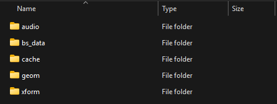

```text
├── audio/                      // All audio tracks and sub folders
│   ├── shot1.wav               // Original audio track
│   ├── shot2.wav               // Original audio track
│   └── aug/                    // Augmented audio sub-folder (optional)
│       ├── voice1/             // Augmented voice sub-folder
│       │   ├── shot1.wav       // Augmented audio track
│       │   └── shot2.wav       // Augmented audio track
│       └── voice2/             // Augmented voice sub-folder
│           ├── shot1.wav       // Augmented audio track
│           └── shot2.wav       // Augmented audio track
├── bs_data/                    // Blend shapes data export for skin (and optional tongue)
├── cache/                      // All animation caches
│   ├── skin/                   // Skin animation caches
│   │   ├── shot1/              // Shot sub-folder (if cache is .mc and .xml)
│   │   └── shot2/              // Shot sub-folder (if cache is .mc and .xml)
│   └── tongue/                 // Optional tongue animation caches
│       ├── shot1/              // Shot sub-folder (if cache is .mc and .xml)
│       └── shot2/              // Shot sub-folder (if cache is .mc and .xml)
├── geom/                       // Extra geometry information exports
│   ├── skin/                   // Skin geometry information exports
│   └── tongue/                 // Optional tongue geometry information exports
└── xform/                      // Transformation and blinks exports
```

### Minimal Training Dataset

To run the Training Framework, the absolute minimal dataset must contain the following two components:

* /audio/: The directory containing all the synchronized audio tracks.

* /cache/skin/: The directory containing the corresponding vertex animation caches for the facial mesh.

These two components provide the fundamental pairing of sound and facial motion that the model learns from.

All other data types such as jaw transformations, eye rotations, tongue animation, and blink tracks are considered optional enhancements.

While these additional components can significantly improve the quality, detail, and nuance of the final trained model, they are not strictly required to complete a training. A functional model can be generated using only the core audio and skin cache data.

## Claire Sample Dataset | Step by Step Data Preparation


In this section, we will deconstruct the **Claire dataset** to provide a practical, step-by-step guide on how to create the various components required for a successful Audio2Face-3D training. For this demonstration, all examples will be based on a workflow within **Autodesk Maya**.

The complete, ready-to-use Claire training dataset is available for download from Hugging Face. We highly recommend downloading and exploring these files to gain a clear understanding of the final required structure and format.

* **Download Link:** [Audio2Face-3D Example Dataset: Claire v1.0.0](https://huggingface.co/datasets/nvidia/Audio2Face-3D-Dataset-v1.0.0-claire/tree/main)

The dataset contains ground-truth full-face animation and some other artifacts for an actor named `claire`.

While the Claire dataset is pre-packaged and ready for the Training Framework, this section will detail how each component can be created. Where necessary, we will provide **Python script examples** to demonstrate how to correctly export data from a Maya scene, particularly when generating **.npy** and **.json** file formats.

This section provides a description of all the parts of the dataset, as well as guidelines for preparation of the dataset.

### Audio

&nbsp;&nbsp;&nbsp;&nbsp;&nbsp;&nbsp;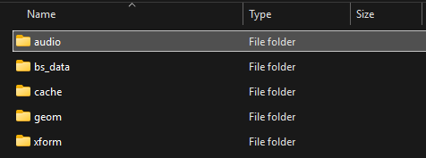

* `audio/cp1_neutral.wav`
* `audio/cp2_neutral.wav`
* `audio/cp33_anger.wav`
    * wav audio tracks with speech for all shots
    * You can use any names for the shots but they need to match animation shot names
    * Only WAV file format is supported
    * Sampling rate should be at least 16000 Hz or higher
    * Bit-depth should be at least 16 bits or higher

You can use tools like [Audacity](https://www.audacityteam.org/) to convert audio tracks to the supported format.

Additional audio tracks can be generated using voice cloning or synthesis applications, such as [Voice Changer](https://elevenlabs.io/voice-changer)

To integrate augmented audio tracks into your dataset, they must be organized into distinct sub-directories within the main audio/aug/ folder. Each sub-directory should contain all the audio tracks corresponding to a single augmented voice, allowing the framework to differentiate between them.

The filenames for the augmented audio tracks must match the names of the original audio tracks they correspond to.

For example, the directory structure should look like this:

```text
dataset/
└── audio/
    ├── shot1.wav               // Original audio track
    ├── shot2.wav               // Original audio track
    ├── ...
    └── aug/                    // Augmented audio folder
        ├── voice1/             // Augmented voice sub-folder
        │   ├── shot1.wav       // Augmented audio track
        │   ├── shot2.wav       // Augmented audio track
        │   └── ...
        └── voice2/             // Augmented voice sub-folder
            ├── shot1.wav       // Augmented audio track
            ├── shot2.wav       // Augmented audio track
            └── ...
```
**Note**: To maintain a minimal file size for the Claire example, the dataset does not include optional augmented audio tracks and looks more like this:

```text
dataset/
└── audio/
    ├── cp1_neutral.wav         // Original voice
    ├── cp2_neutral.wav         // Original voice
    ├── ...
```

### Animation Cache

Animation cache for a single shot could be represented as one of these options: Maya Cache format `.xml + .mc` (can be exported from Autodesk Maya); Point Cache format `.pc2` (can be exported from Blender); NumPy format `.npy` (can be generated using Python). In the Example Dataset the cache is presented in Maya Cache format.

In Maya, it doesn't matter how the character was animated or the facial performance captured. What is important is to export the animation as a cache, one cache per audio track. The cache should be extracted from the stabilized head (without head motion)

&nbsp;&nbsp;&nbsp;&nbsp;&nbsp;&nbsp;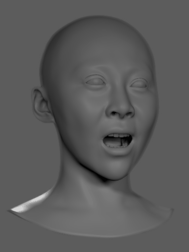

In Maya, from the top menu, you need to export a Geometry cache:

&nbsp;&nbsp;&nbsp;&nbsp;&nbsp;&nbsp;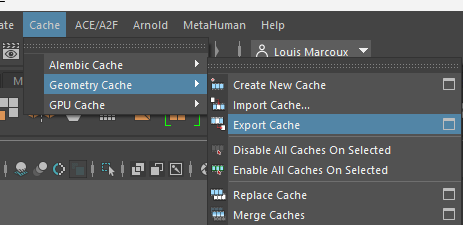

And choose the Maya Cache (mcc) format with the `One file` option (this will generate .mc and .xml files):

&nbsp;&nbsp;&nbsp;&nbsp;&nbsp;&nbsp;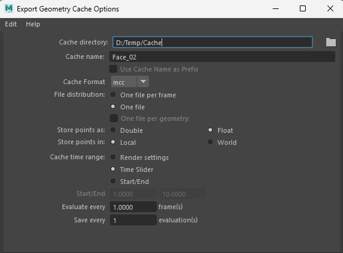

The Claire dataset contains all caches for the corresponding audio tracks.

&nbsp;&nbsp;&nbsp;&nbsp;&nbsp;&nbsp;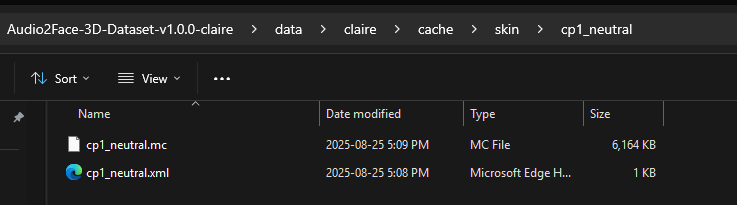

- **Skin**
    - `cache/skin/cp1_neutral/cp1_neutral.xml + cp1_neutral.mc`
    - `cache/skin/cp2_neutral/cp2_neutral.xml + cp2_neutral.mc`
    - ...

- **Tongue**
    - `cache/tongue/cp1_neutral/cp1_neutral.xml + cp1_neutral.mc`
    - `cache/tongue/cp2_neutral/cp2_neutral.xml + cp2_neutral.mc`
    - ...

**Notes**:

- The names of the shots should match the names in the `audio` folder
- The name of the files should match the name of the parent folder (e.g. `cp1_neutral`)
- In the Example Dataset the cache animation is interpreted at 30.0 FPS

For Numpy arrays cache exports:

- Dimensions for a single shot: `[num_frames, num_vertices, 3]`
- Shots can have arbitrary `num_frames`, but need to have same `num_vertices`
- In case of NumPy arrays, data type should be `float32`

**Special Case | No Tongue Data Available**

If your existing facial animation data does not include tongue movement, you can synthesize it using a pre-trained Audio2Face-3D model. By leveraging the Maya-ACE plugin, you can generate high-quality tongue animation for your audio tracks and then export it as a vertex cache to be included in your training dataset. Refer to the Maya-ACE section ( [Using Trained Models in Maya-ACE 2.0](using_maya_ace.md) ) to learn more on how to setup and use Maya-ACE.

There are two primary workflows to consider, depending on your character's technical setup.

- **Use Case 1**: Vertex-Based Animation (Mesh Topology)
    - This workflow is when you are working directly with mesh vertex deformations.
    - **Matching Topology**: If your character's tongue mesh shares the exact same topology as the source model (e.g., the tongue in the Claire sample scene), you can directly generate the animation and export the vertex cache from the source mesh.
    - **Differing Topology**: If your character's tongue has a custom topology, you must first build a retargeting system in Maya. This setup should deform your custom tongue mesh based on the vertex-level deformations of the source mesh. Once the animation is successfully retargeted, you can then export the vertex cache from your animated custom mesh.

        Here is an image showing the Maya nodes when only the tongue mesh is animated by the Maya-ACE A2F Player:

&nbsp;&nbsp;&nbsp;&nbsp;&nbsp;&nbsp;&nbsp;&nbsp;&nbsp;&nbsp;&nbsp;&nbsp;&nbsp;&nbsp;&nbsp;&nbsp;&nbsp;&nbsp;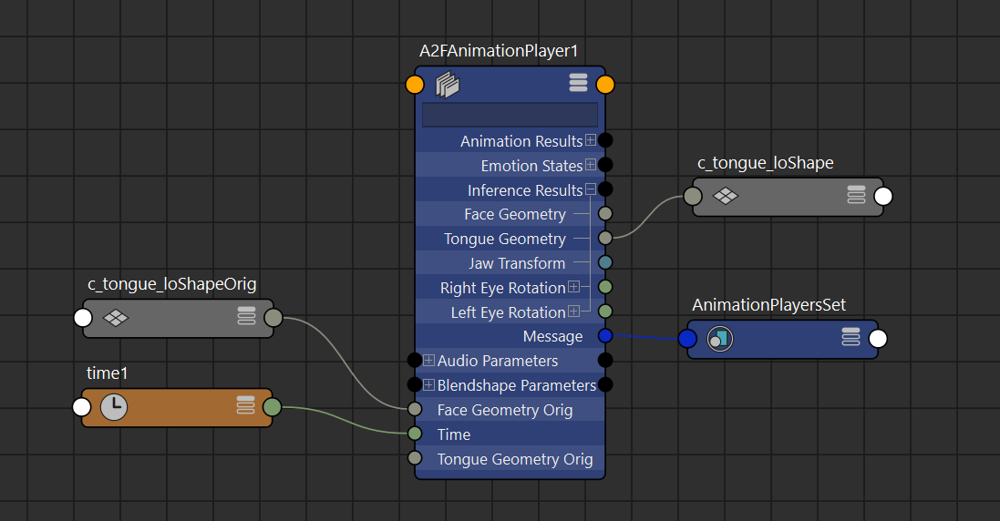

- **Use Case 2**: Blend Shape-Based Animation
    - This workflow applies if your character's tongue is driven by a blend shape system matching the A2F Player's blend shapes outputs.
    - You can use the blend shape weights inferred by a pre-trained model (such as Claire, Mark, or James) within the Maya-ACE plugin to drive your custom blend shape setup. After connecting the model's output weights to your character's blend shape nodes, you can export the resulting animation from your tongue mesh.

        Here is an image showing the Maya nodes when only the tongue blend shapes are animated by the Maya-ACE A2F Player:

&nbsp;&nbsp;&nbsp;&nbsp;&nbsp;&nbsp;&nbsp;&nbsp;&nbsp;&nbsp;&nbsp;&nbsp;&nbsp;&nbsp;&nbsp;&nbsp;&nbsp;&nbsp;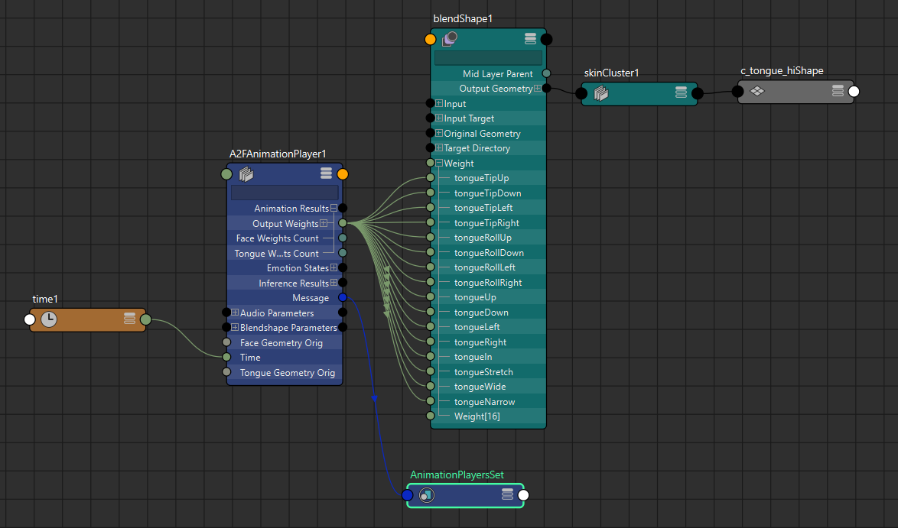

In both cases, once you have a working setup, you can use scripted batch tools to process multiple audio tracks. Here is an example of a batch script that exports caches on the selected mesh in Maya for all audio tracks in a directory. *(You need to configure the variables at the beginning of the script before running.)*

<details>
    <summary>Python Example Script: Cache Batch Exports on Selected Object using Maya-ACE</summary>

```python
"""
Sets up A2F inference using Maya-ACE A2F Player for audio tracks in a directory and exports the animation cache for the selected object in maya.
"""

# Configure these variables before running:

INPUT_AUDIO_DIR = "PATH_TO_INPUT_AUDIO_DIRECTORY"  # Directory containing audio tracks. Example <dataset path>/audio
OUTPUT_DIR = "PATH_TO_OUTPUT_CACHES_DIRECTORY"  # Directory where caches will be saved. Example <dataset path>/cache/tongue
MAYA_A2F_PLAYER_PATH = "A2FAnimationPlayer1" # name of A2F Animation Player in Maya (local inference mode)
OUTPUT_FPS = 30 # Frames per second in Maya's playback settings

# end configure
# -------------

# functionality below
# --------------------

import os
import maya.cmds as cmds
import maya.mel as mel
from ace_tools.audio import set_time_slider_audio

# Create output directory if it doesn't exist
os.makedirs(OUTPUT_DIR, exist_ok=True)

# get selected object in maya
maya_object = cmds.ls(selection=True)[0]

# Supported audio formats
audio_extensions = [".wav", ".aiff", ".mp3"]

# Process each audio track
for filename in os.listdir(INPUT_AUDIO_DIR):
    if any(filename.lower().endswith(ext) for ext in audio_extensions):
        audio_path = os.path.join(INPUT_AUDIO_DIR, filename)
        audio_node = cmds.sound(file=audio_path)

        # Get audio track name without extension for naming the output directory
        audio_name = os.path.splitext(os.path.basename(filename))[0]

        # Create output directory for this audio track
        cache_dir = os.path.join(OUTPUT_DIR, audio_name).replace("\\", "/")
        os.makedirs(cache_dir, exist_ok=True)

        # load audio track in Maya-ACE in local inference mode (A2F Player, not ACE player)
        cmds.connectAttr(f"{audio_node}.filename", f"{MAYA_A2F_PLAYER_PATH}.audiofile", force=True)

        # use Maya-ACE to set the playback range based on audio track
        set_time_slider_audio(f"{audio_node}", fit_range=True)

        # Get time range from current range
        start_time = cmds.playbackOptions(q=True, min=True)
        end_time = cmds.playbackOptions(q=True, max=True)

        # Export cache for each geometry
        cache_name = f"{audio_name}"

        cmds.currentUnit(time=f"{OUTPUT_FPS}fps")
        cmds.select(maya_object)
        command = f"""doCreateGeometryCache 6 {{ "2", "{start_time}", "{end_time}",
            "OneFile", "1", "{cache_dir}","0","{cache_name}","0", "export", "0", "1",
            "1","0","1","mcc","0" }};"""
        mel.eval(command)
```
</details>

### Poses

The Training Framework requires three specific static poses to be exported for the facial mesh. The poses need to be exported as .npy (NumPy) files.

The 3 poses are:
- **Neutral**: exported as `geom/skin/neutral_pose.npy`
- **Eyes Closed**: exported as `geom/skin/eye_close_pose_delta.npy`
- **Lips Opened**: exported as `geom/skin/lip_open_pose_delta.npy`

The image below shows the 3 poses on Claire:

&nbsp;&nbsp;&nbsp;&nbsp;&nbsp;&nbsp;&nbsp;&nbsp;&nbsp;&nbsp;&nbsp;&nbsp;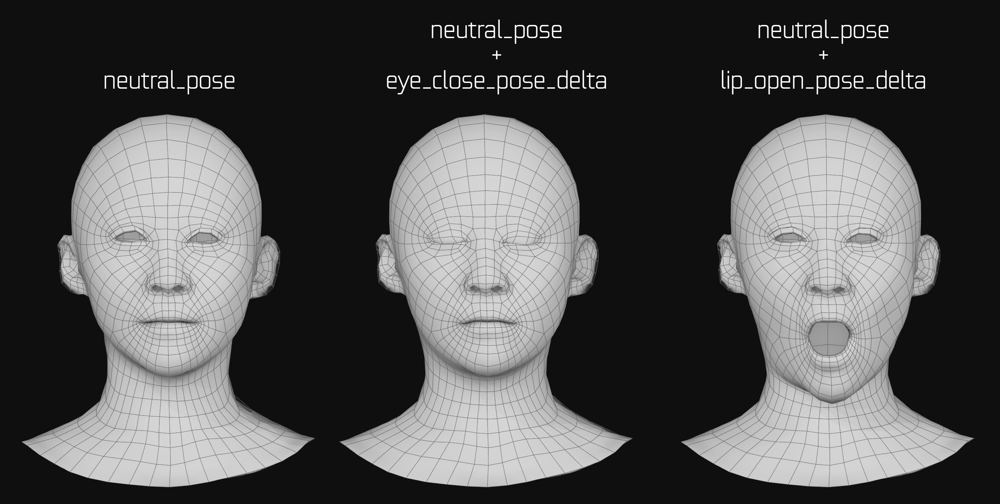

For datasets that include animation for the tongue, the Training Framework requires you to export one specific static pose for the tongue mesh:

- **Neutral**: exported as `geom/tongue/neutral_pose.npy`

The format required for the .npy array for the mesh poses is described here:
- NumPy array with coordinates for all vertices
- Dimensions: `[num_vertices, 3]`
- Data type: `float32`

Since Maya doesn't have tools to export as .npy files directly, here is an example Python script that exports the selected object as .npy files. You can use this script to export once the face is in one of the required poses. *(You need to configure the variables at the beginning of the script before running.)*

<details>
    <summary>Python Example Script: Exports Selected Object Pose as .npy</summary>

```python
"""
Export vertex position of all vertices on the first selected object and saves as an .npy file.
"""

# Configure these variables before running:

OUTPUT_DIR = "PATH_TO_OUTPUT_DIRECTORY"  # Directory where npy files will be saved. example : "<dataset folder path>/geom/skin"
NPY_FILE_NAME = "neutral_pose.npy"      # name of the neutral_pose.npy file

# end configure
# -------------


# functionality below
# --------------------

import os
import maya.cmds as cmds
import maya.api.OpenMaya as om2
import numpy as np

# set the complete path to save the .npy file
npy_path = os.path.join(OUTPUT_DIR, NPY_FILE_NAME)

# extract mesh and vertex information for selected object
selected_object = cmds.ls(selection=True)[0]
selection_list = om2.MSelectionList()
selection_list.add(selected_object)
object_path = selection_list.getDagPath(0)
mesh_fn = om2.MFnMesh(object_path)
points = mesh_fn.getPoints(om2.MSpace.kPreTransform)

# Convert the points to a numpy array of shape [num_vertices, 3] and type float32
vertex_array = np.array([[p.x, p.y, p.z] for p in points], dtype=np.float32)

# save the .npy file
np.save(npy_path, vertex_array)
```
</details>

<br>

All the pose files described above are provided in the Claire sample dataset.

### Vertex Lists for Specific Mesh Areas

To be able to better understand the facial structure, the Training Framework requires information defining which vertices on the mesh correspond to the following key anatomical areas:

- **Upper and Lower Eye Lids**: exported as `geom/skin/eye_dist_vertex_list.json`
    - These vertices will be used to measure the distance between upper and lower eyelids
    - JSON dictionary with two lists of indices of vertices (for upper and lower eyelids)
    - Dictionary Structure: `{"upper": upper_list, "lower": lower_list}`
    - Dimensions for each list: 2 (one for the left eye and one for the right eye)
    - Data type: `int`

&nbsp;&nbsp;&nbsp;&nbsp;&nbsp;&nbsp;&nbsp;&nbsp;&nbsp;&nbsp;&nbsp;&nbsp;&nbsp;&nbsp;&nbsp;&nbsp;&nbsp;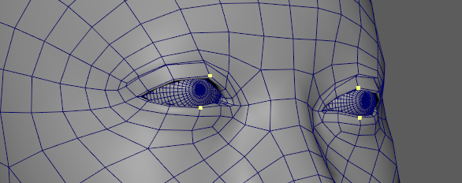

Here is a Python script example that allows to select vertices on the face mesh and export the .json file as follows:
- The first half of selected vertices as upper list
- The second half as lower list

For the script to work, upper vertices need to be selected on both sides first and then lower vertices. Once selected, run the script. (Note that there is no error checking in the script). *(You need to configure the variables at the beginning of the script before running.)*

<details>
    <summary>Python Example Script: Export Selected Vertices Indices for Upper and Lower Eye Lids</summary>

```python
"""
Export selected vertices indices as .json file. Selection order is 1) upper eyes vertices 2) lower eyes vertices. Same number of vertices for both eyes and same number of vertices for upper and lower.
"""

# Configure these variables before running:

OUTPUT_DIR = "PATH_TO_OUTPUT_DIRECTORY"  # Directory where npy files will be saved. example : "<dataset folder path>/geom/skin"
JSON_FILE_NAME = "eye_dist_vertex_list.json" # name of the eye_dist_vertex_list.json file

# end configure
# -------------


# functionality below
# --------------------

import os
import maya.cmds as cmds
import json
import re

# get selection (script only works if there is a vertex selection)
vertex_selection = cmds.ls(selection=True)

# get the selected vertices indices
vertex_indices = [int(re.search(r'\[(\d+)\]', v).group(1)) for v in cmds.ls(vertex_selection, flatten=True)]

# split the vertex indices list in 2
mid = len(vertex_indices) // 2
vertices_dict = {"upper": vertex_indices[:mid], "lower": vertex_indices[mid:]}

# export as json file
json_file_path = os.path.join(OUTPUT_DIR, JSON_FILE_NAME)
with open(json_file_path, 'w') as jfp:
    json.dump(vertices_dict, jfp, indent=4)
```
</details>
<br>

- **Upper and Lower Lips**: exported as `geom/skin/lip_dist_vertex_list.json`
    - These vertices will be used to measure the distance between upper and lower lips
    - JSON dictionary with two lists of indices of vertices (for upper and lower lips)
    - Dictionary Structure: `{"upper": upper_list, "lower": lower_list}`
    - Dimensions for each list: `[num_lip_dist_vertices]` (we use 5 for upper and 5 for lower)
    - Data type: `int`

&nbsp;&nbsp;&nbsp;&nbsp;&nbsp;&nbsp;&nbsp;&nbsp;&nbsp;&nbsp;&nbsp;&nbsp;&nbsp;&nbsp;&nbsp;&nbsp;&nbsp;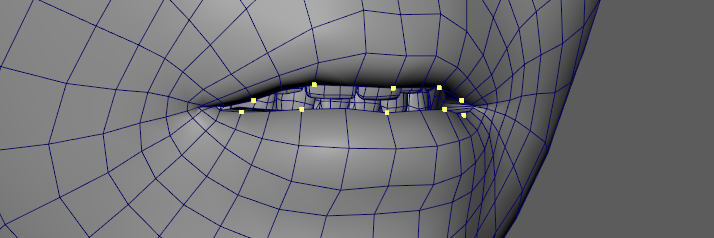

The Python script used for exporting the eye vertex lists can be easily adapted to export the vertex lists for the lips. The required output format (a JSON file containing a dictionary of vertex indices) is identical. To reuse the script, you only need to make one modification: change the json output filename.

- **Lips Size**: exported as `geom/skin/lip_size_vertex_list.json`
    - These vertices will be used to measure the vertical size of upper lip and lower lip
    - JSON dictionary with four lists of indices of vertices: two lists for upper lip (top/bottom) and two lists for lower lips (top/bottom)
    - Dictionary Structure: `{"upper_lip": {"top": top_list, "bottom": bottom_list}, "lower_lip": {"top": top_list, "bottom": bottom_list}}`
    - Dimensions for each list: `[num_lip_size_vertices]` (Claire dataset uses 5 vertices per list)
    - Data type: `int`

&nbsp;&nbsp;&nbsp;&nbsp;&nbsp;&nbsp;&nbsp;&nbsp;&nbsp;&nbsp;&nbsp;&nbsp;&nbsp;&nbsp;&nbsp;&nbsp;&nbsp;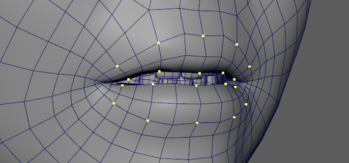

Below is a Python script example that allows to select vertices on the face mesh and export a .json file as follows:
- First quarter of selected vertices as upper top list
- Second quarter of selected vertices as upper bottom list
- Third quarter of selected vertices as lower top list
- Fourth quarter of selected vertices as lower bottom list

For the script to work, vertices need to be selected in the order listed above and the same number of vertices need to be selected for each lip area. Once selected, run the script. You can modify the script to enable other selection workflows if needed. Note that there is no error checking in the script. *(You need to configure the variables at the beginning of the script before running.)*

<details>
    <summary>Python Example Script: Export Selected Vertices Indices for Lips Size</summary>

```python
"""
Export selected vertices indices as .json file. Selection order is 1) upper top lips vertices 2) upper bottom lips vertices 3) lower top lips vertices 4) lower bottom lips vertices. Same number of vertices for upper and lower lips and same number of vertices for upper and bottom for each lip.
"""

# Configure these variables before running:

OUTPUT_DIR = "PATH_TO_OUTPUT_DIRECTORY"  # Directory where npy files will be saved. example : "<dataset folder path>/geom/skin"
JSON_FILE_NAME = "lip_size_vertex_list.json"

# end configure
# -------------


# functionality below
# --------------------

import os
import maya.cmds as cmds
import json
import re

# get selection (script only works if there is a vertex selection)
vertex_selection = cmds.ls(selection=True)

# get the selected vertices indices
vertex_indices = [int(re.search(r'\[(\d+)\]', v).group(1)) for v in cmds.ls(vertex_selection, flatten=True)]

# split the vertex list selected in 2 and in 2 again for final list
mid = len(vertex_indices) // 2
vertices_half1 = vertex_indices[:mid]
vertices_half2 = vertex_indices[mid:]
quart = len(vertex_indices) // 4

vertices_dict = {"upper_lip": {"top": vertices_half1[:quart], "bottom": vertices_half1[quart:]}, "lower_lip": {"top": vertices_half2[:quart], "bottom": vertices_half2[quart:]}}

# export as json file
json_file_path = os.path.join(OUTPUT_DIR, JSON_FILE_NAME)
with open(json_file_path, 'w') as jfp:
    json.dump(vertices_dict, jfp, indent=4)
```
</details>
<br>

For datasets that include an optional animated tongue, it is necessary to define a rigid set of vertices on the tongue mesh. This set should identify a group of vertices that do not deform during all animations.

The framework uses this group of non-deforming vertices to calculate the tongue's overall global transformation (i.e., its position and rotation) as it moves within the mouth. This allows the system to accurately distinguish the rigid movement of the entire tongue from the nuanced deformations of its surface.

- **Non-Moving Vertices** `geom/tongue/rigid_vertex_list.json`
    - These vertices are supposed to have no deformation in tongue animation caches, besides global rotation/translation of the whole tongue in global coordinate system. Usually these vertices should be picked from the bottom the tongue, where no deformation is happening. Number of rigid vertices should be 4 or more.
    - JSON list with indices of rigid tongue vertices.
    - Dimensions: `[num_rigid_vertices]`
    - Data type: `int`

&nbsp;&nbsp;&nbsp;&nbsp;&nbsp;&nbsp;&nbsp;&nbsp;&nbsp;&nbsp;&nbsp;&nbsp;&nbsp;&nbsp;&nbsp;&nbsp;&nbsp;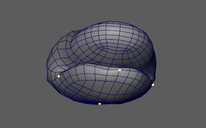

Here is a simple Python script that can export rigid vertices list to a .json file. *(You need to configure the variables at the beginning of the script before running.)*


<details>
    <summary>Python Example Script: Export Selected Vertices Indices as Rigid Tongue Vertices</summary>

```python
"""
Export selected vertices indices as .json file. Selection order is 1) upper eyes vertices 2) lower eyes vertices. Same number of vertices for both eyes and same number of vertices for upper and lower.
"""

# Configure these variables before running:

OUTPUT_DIR = "PATH_TO_OUTPUT_DIRECTORY"  # Directory where npy files will be saved. example : "<dataset folder path>/geom/tongue"
JSON_FILE_NAME = "rigid_vertex_list.json"  # name of the rigid_vertex_list.json file

# end configure
# -------------


# functionality below
# --------------------

import os
import maya.cmds as cmds
import json
import re

# get selection (script only works if there is a vertex selection)
vertex_selection = cmds.ls(selection=True)

# get the selected vertices indices
vertex_indices = [int(re.search(r'\[(\d+)\]', v).group(1)) for v in cmds.ls(vertex_selection, flatten=True)]

# export as json file
json_file_path = os.path.join(OUTPUT_DIR, JSON_FILE_NAME)
with open(json_file_path, 'w') as jfp:
    json.dump(vertex_indices, jfp, indent=4)
```
</details>
<br>

All the vertex lists files described above are provided in the Claire sample dataset.

## Extra **Optional** Training Files

### Jaw Transformations

The Training Framework is capable of learning and inferring jaw transformations as part of the final animation output. However, for the model to generate this motion accurately, it must first be trained on the jaw transformation data from your source animations.

To enable this functionality, you must provide the following two components as part of your dataset:

- **N Vertices Coordinates in Neutral Pose**: exported as `xform/jaw_keypoints_neutral.npy`
    - NumPy array with coordinates of N key points on the jaw for neutral pose
    - Pick N key points on the jaw which are linearly independent (we used N=5 for stability)
    - Dimensions: `[N, 3]`
    - Data type: `float32`

&nbsp;&nbsp;&nbsp;&nbsp;&nbsp;&nbsp;&nbsp;&nbsp;&nbsp;&nbsp;&nbsp;&nbsp;&nbsp;&nbsp;&nbsp;&nbsp;&nbsp;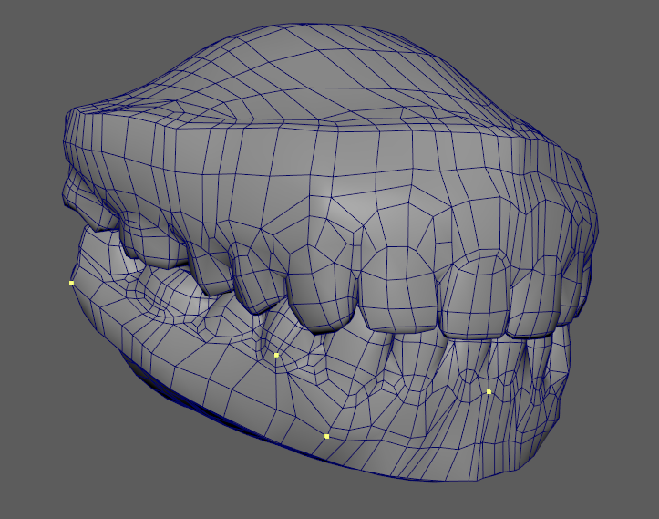

The following example Python script for Autodesk Maya is designed to export the world-space positions of selected vertices and save them in the NumPy array (.npy) format. It is very important to select rigid vertices in order to capture the jaw transformations without any  deformations. *(You need to configure the variables at the beginning of the script before running.)*

<details>
    <summary>Python Example Script: Export Selected Rigid Vertices Positions as Neutral Pose</summary>

```python
"""
Export selected vertices position as .npy file. Can be used for neutral pose export.
"""

# Configure these variables before running:

OUTPUT_DIR = "PATH_TO_OUTPUT_DIRECTORY"  # Directory where npy files will be saved. example : "<dataset folder path>/xform"
NPY_FILE_NAME = "jaw_keypoints_neutral.npy"  # name of the file to export (jaw_keypoints_neutral.npy for neutral positions)

# end configure
# -------------


# functionality below
# --------------------

import os
import maya.api.OpenMaya as om2
import numpy as np

# set the complete path to save the .npy file
npy_path = os.path.join(OUTPUT_DIR, NPY_FILE_NAME)

# get selected vertices
vertex_selection = cmds.ls(selection=True, flatten=True)

# Convert the vertex positions to a numpy array of shape [num_vertices, 3] and type float32
vertex_array = np.array([cmds.pointPosition(v, world=True) for v in vertex_selection], dtype=np.float32)

print(vertex_array)

# save the .npy file
np.save(npy_path, vertex_array)
```
</details>
<br>


- **N Vertices Coordinates Caches in All Animation Shots**: exported as `xform/jaw_keypoints_cache_all.npz`
    - For each animation shot compute the delta coordinates for N key points between their global coordinates (for a given frame) and jaw neutral pose coordinates (delta = cords - neutral_coords)
    - it is important to use the same N vertices as defined in the neutral pose (above)
    - The animation should be extracted from the stabilized head (without head motion)
    - Dictionary of NumPy arrays with ground-truth jaw key point animation (delta) for all shots
    - The FPS is the same as in skin animation caches
    - The keys in the dictionary (names of the shots) should match the shots in `cache` and `audio` folders
    - Dictionary Structure: `{"shot1": coords1, "shot2": coords2, ...}`
    - Dimensions of `coords` array: `[num_frames, N, 3]`
    - Data type: `float32`

The following example Python script for Autodesk Maya is designed to calculate and export the delta animation for a single shot. The "delta" is the per-vertex offset between a deforming mesh and its neutral pose (saved in previous step as .npy file) for each frame of an animation. The animation cache in the example script is saved in .npz format. *(You need to configure the variables at the beginning of the script before running.)*

<details>
    <summary>Python Example Script: Export Selected Rigid Vertices Positions Animation for a Single Shot</summary>

```python
"""
Export selected vertices position animation as .npz file. Can be used to export a single animation shot.
"""

# Configure these variables before running:

OUTPUT_DIR = "PATH_TO_OUTPUT_DIRECTORY"  # Directory where temporary single shot npy files will be saved. example : "<temp folder path>/temp"
NPZ_FILE_NAME = "jaw_keypoints_cache_singleshotname.npz"   # name of the temporary shot name
NPY_NEUTRAL_FILE_DIR = "PATH_TO_NEUTRAL_FILE_DIRECTORY" # Directory where the neutral file was saved. example : "<dataset folder path>/xform"
NPY_NEUTRAL_FILE = "jaw_keypoints_neutral.npy"  # name of the neutral file

# end configure
# -------------


# functionality below
# --------------------

import os
import maya.api.OpenMaya as om2
import numpy as np

# set the complete path to load the neutral .npy file and load it
neutral_npy_path = os.path.join(NPY_NEUTRAL_FILE_DIR, NPY_NEUTRAL_FILE)
neutral_pos = np.load(neutral_npy_path)

# set the complete path to save the .npz file
npz_path = os.path.join(OUTPUT_DIR, NPZ_FILE_NAME)

# get selected vertices
vertex_selection = cmds.ls(selection=True, flatten=True)

# get Maya's time range
start_frame = int(cmds.playbackOptions(query=True, minTime=True))
end_frame = int(cmds.playbackOptions(query=True, maxTime=True))

# Convert the vertex positions to a numpy array of shape [num_vertices, 3] and type float32
vertex_pos_cache = []

# iterate through all frames of the animation
for i, frame in enumerate(range(start_frame, end_frame + 1)):
    cmds.currentTime(frame)
    vertex_array = np.array([cmds.pointPosition(v, world=True) for v in vertex_selection], dtype=np.float32)
    vertex_delta_array = vertex_array - neutral_pos.astype(np.float32)
    vertex_pos_cache.append(vertex_delta_array)

# save the .npy file
np.savez(npz_path, anim=vertex_pos_cache)
```
</details>
<br>

The final step in preparing the jaw animation data is to consolidate all the individual shot caches into a single file. The following Python script is a utility designed for this purpose. It combines multiple .npz cache files located in an input directory and combines them into a single, properly structured .npz archive that is ready for the Training Framework. *(You need to configure the variables at the beginning of the script before running.)*

<details>
    <summary>Python Example Script: Combine Multiple NPZ Files in a Single Cache NPZ File</summary>

```python
"""
Combines multiple npz files representing single animation shots into a single npz file containing all animation shots.
"""

# Configure these variables before running:

INPUT_DIR = "PATH_TO_TEMP_CACHE_FILES_FOR_INDIVIDUAL_SHOTS"   # Directory where temporary shots npz files were saved. example : "<temp folder path>/temp"
OUTPUT_DIR = "PATH_TO_OUTPUT_DIRECTORY"  # Directory where npz files will be saved. example : "<dataset folder path>/xform"
NPZ_FILE_NAME = "jaw_keypoints_cache_all.npz"
SHOTS_CACHE_FILES = {                                               # dictionary of all shots names with corresponding .npz temp animation cache
    "shot_name_1" : "jaw_keypoints_cache_singleshotname1.npz",
    "shot_name_2" : "jaw_keypoints_cache_singleshotname2.npz",
    "shot_name_3" : "jaw_keypoints_cache_singleshotname3.npz"
    }

# end configure
# -------------


# functionality below
# --------------------

import os
import numpy as np

# set the complete path to save the .npz file
npz_path = os.path.join(OUTPUT_DIR, NPZ_FILE_NAME)

# start from an empty dictionary
shots_caches = {}

# add all the individual caches to the dictionary with the shot name as the key
for shotname, shotfile in SHOTS_CACHE_FILES.items():
    shotfile_path = os.path.join(INPUT_DIR, shotfile)
    shots_caches[shotname] = np.load(shotfile_path)

# save the npz file
np.savez(npz_path, **shots_caches)
```
</details>
<br>

For a practical example of the jaw transformation data files, you can refer to the .npy and .npz files provided within the Claire training dataset sample.

### **Optional** Eyes Animations

The Training Framework supports the inclusion of optional eye rotation data and blink timing. This allows the model to generate eye movement. If this data is not provided, eye rotations and blinking will not be part of the generated animation.

The following optional data can be used in the Training Framework for eye animation.

- **Eyes Rotations for All Animation Shots**: eye movement in training animation shots exported as `xform/eye_rotations_all.npz`
    - Dictionary of NumPy arrays with ground-truth eye rotation angles for all shots
    - The FPS is the same as in skin animation caches
    - The keys in the dictionary (names of the shots) should match the shots in `cache` and `audio` folders
    - Dictionary Structure: `{"shot1": angles1, "shot2": angles2, ...}`
    - Dimensions of `angles` array: `[num_frames, 2, 2]`
    - Data type: `float32`

    If your character's eyes are controlled by transform nodes (e.g., joints or locators), the most direct method is to select these nodes in Maya and export their X (pitch) and Y (yaw) rotation animation curves

    For setups where eye movement is driven by other means (such as blend shapes or vertex caches), it is possible to build a rotations evaluation rig. This rig would translate the non-transformational animation back into rotation values that can then be exported. However, the creation of such a rig beyond the scope of this guide.

    The Training Framework requires a single .npz file containing the data for all identified shots.

    Here is a sample Python script that exports the X and Y rotations animations of selected nodes in Maya for a single shot. For the script to work, select the 2 nodes that represent the eyes rotations. *(You need to configure the variables at the beginning of the script before running.)*

<details>
    <summary>Python Example Script: Exports Selected Object X and Y Rotation Animation for a Single Shot as .npz</summary>

```python
"""
Exports the X and Y rotations animations of the selected object as .npz for a single animation shot.
"""

# Configure these variables before running:

OUTPUT_DIR = "PATH_TO_OUTPUT_DIRECTORY"  # Directory where npy files will be saved. example : "<temp folder path>/temp"
NPZ_FILE_NAME = "eye_rotations_singleshot.npz"     # name of the single shot temporary file

# end configure
# -------------


# functionality below
# --------------------

import os
import maya.cmds as cmds
import numpy as np

# set the complete path to save the .npy file
npz_path = os.path.join(OUTPUT_DIR, NPZ_FILE_NAME)

# get Maya's time range
start_frame = int(cmds.playbackOptions(query=True, minTime=True))
end_frame = int(cmds.playbackOptions(query=True, maxTime=True))

# get selected objects
selected_objects = cmds.ls(selection=True)

# Convert the vertex positions to a numpy array of shape [num_vertices, 3] and type float32
objects_rot_cache = []

# iterate through all frames of the animation
for i, frame in enumerate(range(start_frame, end_frame + 1)):
    current_frame_rot = []
    for selected_object in selected_objects:
        rotation = cmds.xform(selected_object, query=True, worldSpace=True, rotation=True)
        rotation_xy = np.array([rotation[0], rotation[1]], dtype=np.float32)
        current_frame_rot.append(rotation_xy)
    objects_rot_cache.append(current_frame_rot)

# save the .npy file
np.savez(npz_path, rotations=objects_rot_cache)
```
</details>
<br>

To combine all resulting cache files in a single one, you can adapt the script provided in the jaw transformation section for combining multiple .npz cache files.

- **Eyes Saccade Movement Pattern**: high-frequency eye movement patterns (eye dart) of a single node exported as `xform/eye_saccade_rotations.npy`
    - NumPy array with saccade movement rotation angles
    - The animation is interpreted as 30 FPS
    - Dimensions: `[num_frames, 2]`
    - Data type: `float32`

    This is a single shot animation export. It can be exported using the following example Python script. *(You need to configure the variables at the beginning of the script before running.)*

<details>
    <summary>Python Example Script: Exports Selected Object X and Y Rotation Animation for a Single Shot as .npy</summary>

```python
"""
Exports the X and Y rotations animations of the selected object as .npy for a single animation shot.
"""

# Configure these variables before running:

OUTPUT_DIR = "PATH_TO_OUTPUT_DIRECTORY"  # Directory where npy files will be saved. example : "<dataset folder path>/xform"
NPY_FILE_NAME = "eye_saccade_rotations.npy"

# end configure
# -------------


# functionality below
# --------------------

import os
import maya.cmds as cmds
import numpy as np

# set the complete path to save the .npy file
npy_path = os.path.join(OUTPUT_DIR, NPY_FILE_NAME)

# get Maya's time range
start_frame = int(cmds.playbackOptions(query=True, minTime=True))
end_frame = int(cmds.playbackOptions(query=True, maxTime=True))

# get selected object
selected_object = cmds.ls(selection=True)[0]

# Convert the vertex rotation to a numpy array of data type [num_frames, 2] float32
rot_cache = []

# iterate through all frames of the animation
for i, frame in enumerate(range(start_frame, end_frame + 1)):
    rotation = cmds.xform(selected_object, query=True, worldSpace=True, rotation=True)
    rotation_xy = np.array([rotation[0], rotation[1]], dtype=np.float32)
    rot_cache.append(rotation_xy)

# save the .npy file
np.save(npy_path, rot_cache)
```
</details>
<br>

- **Blinks Timing**: timing for eye blinks exported as `xform/eye_blink_keys.npy`
    - NumPy array with animation of as single eye blink, represented as keyframes for blending coefficient in range [0, 1]
    - Value "0.0" represents "eyes open", and value "1.0" represents "eyes closed"
    - The animation is interpreted as 30 FPS
    - Dimensions: `[num_frames]`
    - Data type: `float32`

    This export should contain a simple animation with values ranging from 0.0 (eyes open) to 1.0 (eyes fully closed). Unlike the facial performance data, this blink animation can be of any length and does not need to be synchronized with any specific audio track.

    The source for this blink timing data can be any animated channel in your scene that produces the required normalized 0.0 to 1.0 value.

    The following example Python script for Maya is configured to read the Y-translation of a selected object and use it for animations values. The object need to move up and down in the range 0.0-1.0 the generate expected animation. This script can be easily adapted for any other attribute (e.g., a custom attribute on your character rig) to fit your specific workflow. *(You need to configure the variables at the beginning of the script before running.)*

<details>
    <summary>Python Example Script: Exports Selected Object Y Position (0.0-1.0 range) for Single Animation Shot as .npy</summary>

```python
"""
Exports selected object's Y position animation (0.0-1.0 range) for Single Animation Shot as .npy
"""

# Configure these variables before running:

OUTPUT_DIR = "PATH_TO_OUTPUT_DIRECTORY"  # Directory where npy files will be saved. example : "<dataset folder path>/xform"
NPY_FILE_NAME = "eye_blink_keys.npy"    # name of the eye_blink_keys.npy file

# end configure
# -------------


# functionality below
# --------------------

import os
import maya.cmds as cmds
import numpy as np

# set the complete path to save the .npy file
npy_path = os.path.join(OUTPUT_DIR, NPY_FILE_NAME)

# get Maya's time range
start_frame = int(cmds.playbackOptions(query=True, minTime=True))
end_frame = int(cmds.playbackOptions(query=True, maxTime=True))

# get selected object
selected_object = cmds.ls(selection=True)[0]

# Convert the vertex position  to a numpy array of data type [num_frames] float32
blink_cache =  np.array([], dtype=np.float32)

# iterate through all frames of the animation
for i, frame in enumerate(range(start_frame, end_frame + 1)):
    position = cmds.xform(selected_object, query=True, worldSpace=True, rotation=True)
    position_y = position[1]
    if position_y > 1.0: position_y = 1.0
    if position_y < 0.0: position_y = 0.0
    blink_cache = np.append(blink_cache, position_y)

# save the .npy file
np.save(npy_path, blink_cache)
```
</details>
<br>

**Important Note**: If you are using Maya-ACE for animation inference, please note that eye blinking has not been implemented in the plugin.

For a practical example of the eyes animations data files, you can refer to the .npy and .npz files provided within the Claire training dataset sample.

### Optional Blend Shapes Data

Blend Shapes data is not part of the training data, but is intended for network deployment with the model so that the model can inference blend shape weights values.

Blend shapes data consist of a .npz file containing the geometry data and a corresponding configuration file that defines the blend shapes parameters for solving.

It is not mandatory to have blend shapes for a training. Also, if a skin blend shapes setup is provided, it is not mandatory to have a tongue setup.

A blend shape setup must be created from the same mesh topology as the mesh in the training data. The neutral pose of the blend shape setup must be identical in shape and topology to the neutral pose of the training dataset. Any number of blend shapes and naming convention is supported. But it is important to note that large amounts of blend shapes (100 and above) will slow down inference.

The Claire data set provides a blend shapes setup that is based on the ARKit standard. More information about this setup can be found here: [Apple ARKit BlendShapes](https://developer.apple.com/documentation/arkit/arfaceanchor/blendshapelocation). Note that in the provided `mouthClose` shape, unlike the standard ARKit model, `jawOpen` is included (i.e., `a2f mouthClose = jawOpen + mouthClose`)

Here are the files needed to define a blend shapes setup.

- **Skin Blend Shapes Configuration**: parameters used for the skin blend shapes solve, saved as: `bs_data/bs_skin_config.json`
    - JSON files containing blendshape solver settings for skin geometry.
    - `blendshape_params` fields:
        - `strengthL2regularization`: Discourages large weight magnitudes, promoting smoother and more stable solutions
            - Data: `float`
        - `strengthL1regularization`: Encourages sparsity in the blendshape weights, activating fewer poses per frame
            - Data: `float`
        - `strengthTemporalSmoothing`: Penalizes abrupt changes in weights across consecutive frames, reducing visual pops and ensuring temporal coherence.
            - Data: `float`
        - `strengthSymmetry`: Encourages symmetric poses (defined in `bsSolveSymmetryPoses`) to activated together
            - Data: `float`
        - `numPoses`: Total number of blendshapes (excluding the neutral)
            - Data: `int`
        - `bsSolveActivePoses`: Indicates which poses are active (0 = inactive, 1 = active)
            - Data: `int` array `[numPoses]`
        - `bsSolveCancelPoses`: Defines mutually exclusive pairs where only one of the two shapes can be active at a time
            - Data: `int` array `[numPoses]`
            - Format: Elements with the same non-negative ID form a pair; `-1` means unpaired
        - `bsSolveSymmetryPoses`: Defines symmetric pairs where both shapes are expected to activate together in a coordinated manner
            - Data: `int` array `[numPoses]`
            - Format: Elements with the same non-negative ID form a pair; `-1` means unpaired
        - `bsWeightMultipliers`, `bsWeightOffsets`: Scale and bias applied to blendshape weights
            - Data: `float` array `[numPoses]`
        - `templateBBSize`: Vertical bounding box height of the neutral mesh (in cm)
            - Data: `float`

The Claire blend shapes configuration files can be used as templates to create custom blend shapes setup configuration.

- **Tongue Blend Shapes**: tongue blend shapes geometry, exported as: `bs_data/bs_tongue.npz`
    - NumPy archive containing tongue-specific blendshape data in delta form
    - `poseNames`: List of tongue blendshape pose names including the neutral shape.
        - Data: `str` array `[17]`  (neutral + 16 tongue shapes)
    - `neutral`: Neutral tongue geometry
        - Data: `float32` array `[num_vertices, 3]`
    - *`<pose name>`*: Blendshape delta arrays (displacement from the neutral pose). One field per entry in `poseNames` (eg. `tongueUp`,`tongueLeft`...)
        - Data: `float32` array `[num_vertices, 3]`
    - `rig_version`: Rig version identifier
        - Data: `str`

The tongue setup can have a different amount and naming convention that the skin setup. They are independent of each other.

The Claire example dataset blend shapes setup consists of 16 blend shapes:

- TongueTipUp
- TongueTipDown
- TongueTipLeft
- TongueTipRight
- TongueRollUp
- TongueRollDown
- TongueRollLeft
- TongueRollRight
- TongueUp
- TongueDown
- TongueLeft
- TongueRight
- TongueIn
- TongueStretch
- TongueWide
- TongueNarrow

The same example Python scripts and workflow as the skin blend shapes example can be used to export the `bs_tongue.npz` from Maya.

- **Tongue Blend Shapes Configuration**: parameters used for the tongue blend shapes solve, saved as: `bs_data/bs_tongue_config.json`
    - JSON files containing blendshape solver settings for tongue geometry.
    - `blendshape_params` fields:
        - `strengthL2regularization`: Discourages large weight magnitudes, promoting smoother and more stable solutions
            - Data: `float`
        - `strengthL1regularization`: Encourages sparsity in the blendshape weights, activating fewer poses per frame
            - Data: `float`
        - `strengthTemporalSmoothing`: Penalizes abrupt changes in weights across consecutive frames, reducing visual pops and ensuring temporal coherence.
            - Data: `float`
        - `strengthSymmetry`: Encourages symmetric poses (defined in `bsSolveSymmetryPoses`) to activated together
            - Data: `float`
        - `numPoses`: Total number of blendshapes (excluding the neutral)
            - Data: `int`
        - `bsSolveActivePoses`: Indicates which poses are active (0 = inactive, 1 = active)
            - Data: `int` array `[numPoses]`
        - `bsSolveCancelPoses`: Defines mutually exclusive pairs where only one of the two shapes can be active at a time
            - Data: `int` array `[numPoses]`
            - Format: Elements with the same non-negative ID form a pair; `-1` means unpaired
        - `bsSolveSymmetryPoses`: Defines symmetric pairs where both shapes are expected to activate together in a coordinated manner
            - Data: `int` array `[numPoses]`
            - Format: Elements with the same non-negative ID form a pair; `-1` means unpaired
        - `bsWeightMultipliers`, `bsWeightOffsets`: Scale and bias applied to blendshape weights
            - Data: `float` array `[numPoses]`
        - `templateBBSize`: Vertical bounding box height of the neutral mesh (in cm)
            - Data: `float`
    - The Claire blend shapes configuration files can be used as templates to create custom blend shapes setup configuration.

- **Skin Blend Shapes**: skin blend shapes geometry, exported as: `bs_data/bs_skin.npz`
    - Dictionary of NumPy arrays containing the blend shape setup.
    - `poseNames`: List of blendshape pose names including the neutral shape.
        - Data: `str` array `[53]`  (neutral + 52 ARKit shapes)
    - `neutral`: Neutral face geometry.
        - Data: `float32` array `[num_vertices, 3]`
    - *`<pose name>`*: Blendshape delta arrays (displacement from the neutral pose). One field per entry in `poseNames` (eg. `jawOpen`,`eyeBlinkLeft`...)
        - Data: `float32` array `[num_vertices, 3]`
    - `frontalMask`: Indices of selected frontal-region vertices used by the blendshape solver instead of the full mesh. This subset is non-uniformly sampled, with higher vertex density in salient regions such as the mouth, eyes, and nasolabial folds. It improves performance and helps the solver focus optimization on the most expressive and perceptually important areas of the face.
        - Data: `int32` array `[num_indices]`
    - `rig_version`: Rig version identifier
        - Data: `str`
    - Dictionary Structure: `{"poseNames": [str], "neutral": [num_vertices, 3], "<pose name>" : [num_vertices, 3], "frontalMask" : [num_indices], "rig_version" : str}`

    The section below provides a collection of example Python scripts designed to facilitate the blend shapes data preparation process. These utilities demonstrate how to export the required data from Autodesk Maya and subsequently assemble the individual files into a final, consolidated .npz file.

    Please note that these scripts are provided as a foundational reference. You are encouraged to modify and adapt them to better suit the specific needs and automation requirements of your own production pipeline. Their primary purpose is to illustrate the fundamental commands of how to generate and format the data correctly from within a 3D software package.

    The script `Python Example Script: Exports Selected Object Pose as .npy`, referenced earlier in this document can be used to export neutral pose and all blend shapes poses as individual files.

    This script can be used to export frontal mark indices from the current vertex selection in Maya. *(You need to configure the variables at the beginning of the script before running.)*

<details>
    <summary>Python Example Script: Export Selected Vertices Indices as .npy Array</summary>

```python
"""
Export selected vertices indices as .json file. Selection order is 1) upper eyes vertices 2) lower eyes vertices. Same number of vertices for both eyes and same number of vertices for upper and lower.
"""

# Configure these variables before running:

OUTPUT_DIR = "PATH_TO_OUTPUT_DIRECTORY"  # Directory where npy files will be saved. example : "<temp path>/temp"
NPY_FILE_NAME = "frontalMask.npy"      # name of the temporary frontal mask file

# end configure
# -------------


# functionality below
# --------------------

import os
import maya.cmds as cmds
import numpy as np
import re

# set the complete path to save the .npy file
npy_path = os.path.join(OUTPUT_DIR, NPY_FILE_NAME)

# get selection (script only works if there is a vertex selection)
vertex_selection = cmds.ls(selection=True)
vertex_indices = [int(re.search(r'\[(\d+)\]', v).group(1)) for v in cmds.ls(vertex_selection, flatten=True)]

# convert to np array
vertex_array = np.array(vertex_indices, dtype=np.int32)

# save array .npy file
np.save(npy_path, vertex_array)
```
</details>
<br>

Blend shapes setup can be assembled in .npz file using the following example script.

<details>
    <summary>Python Example Script: Combine Multiple Data Sources into Blend Shapes Setup NPZ File</summary>

```python
"""
Combines multiple blend shapes data sources into a blend shapes setup .npz file
"""

# Configure these variables before running:

POSES_DIR = "PATH_TO_INDIVIDUAL_BLEND_SHAPES_AND_NEUTRAL_POSE_FILES" # Directory where neutral and pose files were saved example : "<temp path>/temp"
OUTPUT_DIR = "PATH_TO_OUTPUT_DIRECTORY"  # Directory where npz files will be saved. example : "<dataset folder path>/bs_data"
NPZ_FILE_NAME = "bs_skin.npz"

# define Rig Version
RIG_VERSION = "1.0"

# frontal mask file name (assuming it's in the same folder as other temp pose files)
FRONTALMASK_FILE_NAME = "frontalMask.npy"

# neutral pose file name
NEUTRAL_POSE_FILE = "neutral_pose.npy"

# dictionary of all exported individual blend shapes as npy files
BS_POSES_FILES = {
    "blend_shape_name_1" : "blend_shape_pose1.npy",
    "blend_shape_name_2" : "blend_shape_pose3.npy",
    "blend_shape_name_2" : "blend_shape_pose3.npy",
    }

# end configure
# -------------


# functionality below
# --------------------

import os
import numpy as np

# set the complete path to save the .npz file
npz_path = os.path.join(OUTPUT_DIR, NPZ_FILE_NAME)

# start with empty structures
blend_shapes_setup = {}
bs_shapes_names = []

# build from the blend shapes names and temp blend shapes pose files
for key, value in BS_POSES_FILES.items():
    bs_shapes_names.append(key)
    blend_shapes_setup[key] = np.load(os.path.join(POSES_DIR, value))

# finish load and setting the dictionary content for the blend shapes setup
blend_shapes_setup["poseNames"] = bs_shapes_names
blend_shapes_setup["neutral"] = np.load(os.path.join(POSES_DIR, NEUTRAL_POSE_FILE))
blend_shapes_setup["frontalMask"] = np.load(os.path.join(POSES_DIR, FRONTALMASK_FILE_NAME))
blend_shapes_setup["rig_version"] = RIG_VERSION

# save the npz file
np.savez(npz_path, **blend_shapes_setup)
```
</details>

### Reference Files and Test Scenes

Extra files, not required for the Training Framework, are provided with the Claire dataset.

- `geom/fullface/a2f_maya_scene.mb`
    - Maya scene file with a template of the full face, containing at least skin, tongue, eyes and gums. This scene can be used to test inference in Maya-ACE.

&nbsp;&nbsp;&nbsp;&nbsp;&nbsp;&nbsp;&nbsp;&nbsp;&nbsp;&nbsp;&nbsp;&nbsp;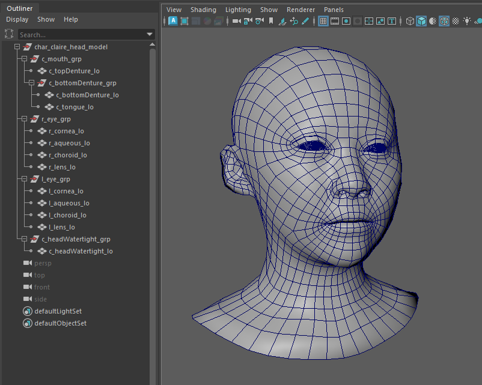

- `geom/fullface/template.usd`
    - USD file with a template of the full face, containing at least skin, tongue, eyes and gums

&nbsp;&nbsp;&nbsp;&nbsp;&nbsp;&nbsp;&nbsp;&nbsp;&nbsp;&nbsp;&nbsp;&nbsp;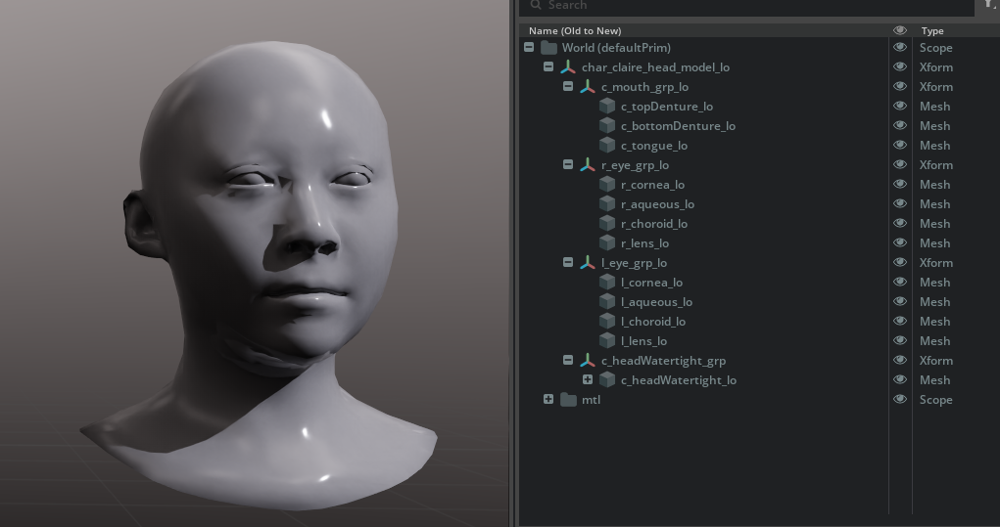

### Troubleshooting Missing Python Modules

This document contains multiple Python script snippets. It may occur that Python modules may be missing when running the scripts in your version of Maya. If this happens, follow these steps:

1. In the Maya script editor, run the following commands in Python:

```python
import sys
for path in sys.path:
    print(path)
```
This will print all paths that are in the systems path and recognized by Maya. Find a path in the list that looks like this:

```text
C:/Users/<user name>/Documents/maya/2024/scripts
```
This is your `target path`, where you want the Python module to be installed so that it is found by Maya.

2. Open a PowerShell and go to the Maya install folder's `bin` subfolder. For example:

```text
<Programs Files Drive>:/Program Files/Autodesk/Maya2024/bin/
```

3. In the PowerShell, run the following command:

```text
mayapy.exe -m pip install <missing module> --target "<target path>"
```
For example, if the Numpy Python module is missing in Maya 2024:
```text
mayapy.exe -m pip install numpy --target "C:/Users/<user name>/Documents/maya/2024/scripts"
```

4. Restart Maya

The Python module should now load correctly.

***

[Back](../README.md)
