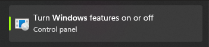
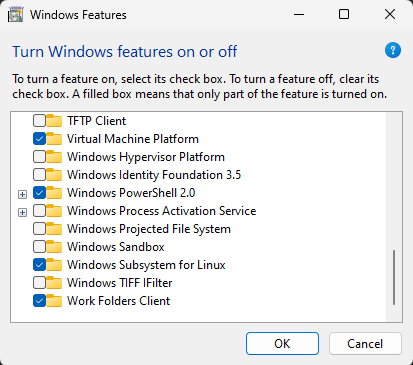

# Training Framework

## Table of Contents

- [Framework Architecture](#framework-architecture)
- [Using the Framework](#using-the-framework)
- [Running the Framework](#running-the-framework)
- [Multi-Actor Support](#multi-actor-support)
- [VSCode Development and Debugging](#vscode-development-and-debugging--advanced)
- [Beginner's Guide: Detailed Setup Under Windows (WSL2 / Ubuntu)](#detailed-setup-under-windows-wsl2--ubuntu--beginners-guide)

## Framework Architecture

The framework operates in a containerized environment where all execution occurs inside a Docker container. This approach provides a consistent environment without requiring users to set up dependencies locally.

### Pipeline Overview


The complete pipeline consists of:

1. **Preprocessing**: Dataset preparation and feature extraction
2. **Training**: Neural network training with custom configurations
3. **Deployment**: Model packaging for Maya-ACE

### Directory Structure

```
Audio2Face-3D-Training-Framework/
├── audio2face/               # Core framework code
├── configs/                  # Config files
│   ├── example-diffusion/    # Example config
│   └── <your_config>/        # Your custom configs
├── docker/                   # Docker scripts
├── docs/                     # Documentation
├── runners/                  # Internal framework execution scripts
├── tools/                    # Development tools
├── .env                      # Environment configuration
├── README.md                 # Main project documentation
├── run_preproc.py            # Preprocessing execution script
├── run_train.py              # Training execution script
├── run_deploy.py             # Deployment execution script
└── run_inference.py          # Inference execution script
```

## Using the Framework

### Configuration System

The framework uses a two-tier configuration system that combines base configurations with user overrides:

#### Base Configurations

All configuration parameters are defined in base configuration files located in `audio2face/config_base/`:

- `config_dataset_base.py` - Base dataset parameter definitions
- `config_preproc_base.py` - Base preprocessing parameter definitions
- `config_train_regression_base.py` - Base training parameters for regression
- `config_train_diffusion_base.py` - Base training parameters for diffusion
- `config_inference_regression_base.py` - Base inference parameters for regression
- `config_inference_diffusion_base.py` - Base inference parameters for diffusion

These base configurations contain all available parameters with their default values and serve as the foundation for all framework operations (preprocessing, training, deployment, and inference).

**Note**: Do not modify these base configuration files directly. Instead, create your own configuration files in the `configs/` directory or modify the provided example configurations (see below).

#### User Configurations

Each complete workflow (preprocessing -> training -> deployment -> inference) is defined by a config directory located at `configs/<CONFIG_NAME>/` that can contain up to four configuration files:

- `config_dataset.py` - Dataset parameters and paths
- `config_preproc.py` - Preprocessing parameters
- `config_train.py` - Training parameters
- `config_inference.py` - (Optional) Inference parameters for deployment or local python inference

**Note**: These files contain only the parameters you want to override from the base configurations. You don't need to specify every parameter, just the ones you want to change.

#### Example Configurations

The Training Framework provides example configurations for **Regression** and **Diffusion** training methodologies. These files are pre-populated with default values that are suitable for the Claire example dataset. While they serve as a robust starting point for your own training runs, it is essential that you modify and override these settings to suit the unique characteristics of your own training data.

**Regression Training** (the standard approach):
- `configs/example-regression/` - Full example setup for regression-based training
- `configs/example-regression-min/` - Minimal example for regression (fewer dataset requirements)

**Diffusion Training** (the more advanced approach, often capable of producing higher-fidelity results):
- `configs/example-diffusion/` - Full example setup for diffusion-based training
- `configs/example-diffusion-min/` - Minimal example for diffusion (fewer dataset requirements)

Each example demonstrates how to override specific parameters from the base configurations for different training scenarios.

#### How Configuration Loading Works

1. Base configuration is loaded from `audio2face/config_base/`
2. User configuration from `configs/<CONFIG_NAME>/` is applied as a modifier to override specific parameters
3. The merged configuration is passed to the framework modules

**Note**: A2F-TF uses the `ACTOR_NAME` notation to separate actors in multi-actor mode. When working with only one actor, you can have a unified actor name across all config dictionaries.

Please refer to the [Configuration Guide](config_details.md) to learn about each configuration field.

## Running the Framework

### Stage 1: Preprocessing

Before training, your dataset must be preprocessed:

1. **Configure Dataset**: Edit `configs/<CONFIG_NAME>/config_dataset.py`
    - Set dataset paths (relative to `/datasets` directory)
    - Configure dataset-specific parameters

2. **Configure Preprocessing**: Edit `configs/<CONFIG_NAME>/config_preproc.py`
    - Set preprocessing parameters
    - Configure feature extraction settings

3. **Run Preprocessing**:
    ```bash
    python run_preproc.py <CONFIG_NAME> <ACTOR_NAME>
    ```
    Output: `workspace/output_preproc/<PREPROC_RUN_NAME_FULL>`

### Stage 2: Training

After preprocessing, train your model:

1. **Configure Training**: Edit `configs/<CONFIG_NAME>/config_train.py`
    - Set `PREPROC_ROOT` and `PREPROC_RUN_NAME_FULL` to use preprocessing artifacts
    - Configure the `CLIPS` parameter for training data
    - Optionally set `AUG_MUTED_SHOTS` for data augmentation

2. **Run Training**:
    ```bash
    python run_train.py <CONFIG_NAME>
    ```

    Output: `workspace/output_train/<TRAINING_RUN_NAME_FULL>`

### Stage 3: Deployment

Package your trained model for Maya-ACE:

1. **Configure Inference**: Edit `configs/<CONFIG_NAME>/config_inference.py`
    - Set post-processing parameters

2. **Run Deployment**:
    ```bash
    python run_deploy.py <CONFIG_NAME> <TRAINING_RUN_NAME_FULL>
    ```

    Output: `workspace/output_deploy/<TRAINING_RUN_NAME_FULL>`

Once deployment is complete, it is possible to validate the resulting model in Maya-ACE or use the `run_inference.py` inference test script. You can find more details about this in [Quick Start](../README.md/#quick-start) and [Using Maya-ACE 2.0](using_maya_ace.md) sections.

## Multi-Actor Support

The framework supports training models for multiple actors in diffusion mode.

**Config System**: Multi-actor support is implemented through dictionary-based config parameters where each actor name serves as a key mapped to actor-specific values:

- Actor-specific parameters: `PARAM = {"actor1": value1, "actor2": value2}`
- If an actor is missing from a parameter dictionary, the system may use fallback behavior

### Preprocessing Multiple Actors

```bash
python run_preproc.py <CONFIG_NAME> <ACTOR_NAME1>
python run_preproc.py <CONFIG_NAME> <ACTOR_NAME2>
python run_preproc.py <CONFIG_NAME> <ACTOR_NAME3>
```

### Configure Training for Multi-Actor

In `configs/<CONFIG_NAME>/config_train.py`:

```python
PREPROC_RUN_NAME_FULL = {
    "actor_name1": "XXXXXX_XXXXXX_actor1",
    "actor_name2": "XXXXXX_XXXXXX_actor2",
    "actor_name3": "XXXXXX_XXXXXX_actor3",
}
```

In `configs/<CONFIG_NAME>/config_dataset.py`:

```python
ACTOR_NAMES = [
    "actor_name1",
    "actor_name2",
    "actor_name3",
]
```

## VSCode Development and Debugging | *Advanced*

For enhanced development experience with VSCode debugging capabilities:

1. **Install Required Extension**

    Install the [Dev Containers](https://marketplace.visualstudio.com/items?itemName=ms-vscode-remote.remote-containers) extension from the VSCode marketplace.

2. **Start Development Container**

    Run the development shell script to start the container:
    ```bash
    ./docker/run_shell.sh
    ```

3. **Attach VSCode to Container**

    In VSCode, use the "Dev Containers: Attach to Running Container" command to connect to the running development container.

4. **Configure Debug Parameters**

    Before debugging, modify the hardcoded parameters in the `args = SimpleNamespace` section of each debug runner file:

    - `runners/run_preproc_debug.py`:
        ```python
        args = SimpleNamespace(
            actor_name="claire",              # Change to your actor name
            config_name="example-diffusion",  # Change to your config name
        )
        ```

    - `runners/run_train_debug.py`:
        ```python
        args = SimpleNamespace(
            config_name="example-diffusion",  # Change to your config name
        )
        ```

    - `runners/run_deploy_debug.py`:
        ```python
        args = SimpleNamespace(
            training_run_name_full="XXXXXX_XXXXXX_XXX",  # Change to actual training run name
            config_name="example-diffusion",             # Change to your config name
        )
        ```

    - `runners/run_inference_debug.py`:
        ```python
        args = SimpleNamespace(
            training_run_name_full="XXXXXX_XXXXXX_XXX",  # Change to actual training run name
            config_name="example-diffusion",             # Change to your config name
        )
        ```

5. **Start Debugging**

    Use the existing VSCode launch configurations in `.vscode/launch.json`:
    - **Debug Preprocessing** - Runs `run_preproc_debug.py`
    - **Debug Training** - Runs `run_train_debug.py`
    - **Debug Deployment** - Runs `run_deploy_debug.py`
    - **Debug Inference** - Runs `run_inference_debug.py`

    Navigate to the Debug tab in VSCode and select the appropriate configuration to start debugging.

This setup allows you to set breakpoints, inspect variables, and step through the code during development.

## Detailed Setup Under Windows (WSL2 / Ubuntu) | *Beginner's Guide*

### Prerequisites

Before proceeding with the setup for the Training Framework, please ensure your system meets the following minimum requirements.

- **Storage:** A minimum of 1 GB of free disk space is required for the framework components and the example dataset.

- **Hardware:** A CUDA-compatible NVIDIA GPU with at least 6 GB of VRAM.

- **NVIDIA Driver:** Use the following supported version ranges. Download drivers from the official [NVIDIA Driver Downloads page](https://www.nvidia.com/en-us/drivers/):
  - Linux: 575.57 - 579.x
  - Windows/WSL2: 576.57 - 579.x

### Enable WSL2 on Windows

To be able to install Ubuntu in Windows, virtualisation must be enabled at hardware level. Since all hardware has different setup, you can refer to this guide from Microsoft to enable virtualisation on your device.

https://support.microsoft.com/en-us/windows/enable-virtualization-on-windows-c5578302-6e43-4b4b-a449-8ced115f58e1

Then, follow these steps:

1. Open "Windows Features" dialog by typing "Windows Features" in Windows Search bar. Choose the "Turn Windows features on or off" control panel.

&nbsp;&nbsp;&nbsp;&nbsp;&nbsp;&nbsp;&nbsp;&nbsp;&nbsp;&nbsp;&nbsp;&nbsp;

2. Make sure "Windows Subsystems for Linux" is enabled and click ok.

&nbsp;&nbsp;&nbsp;&nbsp;&nbsp;&nbsp;&nbsp;&nbsp;&nbsp;&nbsp;&nbsp;&nbsp;

### Install WSL2

Open a `Windows PowerShell`, *as administrator*, and type the following:

```powershell
wsl --version
```

If version is not version 2.x or later, update to WSL 2 by following these steps:

1. In a Windows PowerShell, *as administrator*, type the following commands:

```powershell
dism.exe /online /enable-feature /featurename:Microsoft-Windows-Subsystem-Linux /all /norestart
dism.exe /online /enable-feature /featurename:VirtualMachinePlatform /all /norestart
```

2. Restart your computer

3. Update WSL by installing this [WSL Update](https://wslstorestorage.blob.core.windows.net/wslblob/wsl_update_x64.msi)

4. In a Windows PowerShell, *as administrator*, type the following command:

```powershell
wsl --set-default-version 2
```

**Note**: if you encounter issues with setting up WSL 2, you can refer to the following Microsoft resource: [Windows WSL Installation Guide](https://learn.microsoft.com/en-us/windows/wsl/install)

### Install Ubuntu 22.04 *(Recommended Version)*

To install Ubuntu, follow these steps:

1. In a PowerShell, type:

```powershell
wsl --install --distribution Ubuntu-22.04
```
2. When prompted, create a user name and password:

```powershell
Unix User Name: <create your user name>
Pwd: <create your password>
```

3. Restart your computer.

4. Launch Ubuntu from the Start Menu.

    This will open an Ubuntu shell. In this shell, type the 2 following commands:

```bash
sudo apt update
sudo apt upgrade -y
```

### Install and Start Docker Service

1. Download and install Docker by typing the following commands in the Ubuntu shell *(re-open one if closed)*:

```bash
curl -fsSL https://get.docker.com -o get-docker.sh
sudo sh ./get-docker.sh
```

**Notes**:
- Entering your password in Ubuntu doesn't show when you type.
- It will ask for a wait of 20 seconds before proceeding.

2. Add your user to the "Docker" group by typing the following commands in the Ubuntu shell:

```bash
sudo usermod -aG sudo <username>
sudo usermod -aG adm <username>
sudo groupadd docker
```

**Note**: The group may already exist. Just continue if you get a warning.

```bash
sudo usermod -aG docker <username>
```

3. Close the Ubuntu shell and restart a new Ubuntu shell to test Docker. Type the following command:

```bash
docker run hello-world
```

**Note**: This command might pull from a remote location since it's not available locally on first install.

### Install and Configure NVIDIA Container Toolkit

Start a new Ubuntu shell and type the following:

```bash
curl -fsSL https://nvidia.github.io/libnvidia-container/gpgkey | sudo gpg --dearmor -o /usr/share/keyrings/nvidia-container-toolkit-keyring.gpg && curl -s -L https://nvidia.github.io/libnvidia-container/stable/deb/nvidia-container-toolkit.list | sed 's#deb https://#deb [signed-by=/usr/share/keyrings/nvidia-container-toolkit-keyring.gpg] https://#g' | sudo tee /etc/apt/sources.list.d/nvidia-container-toolkit.list
```

**Note**: Make sure to respect all spaces in the command. There will be issues if spaces are removed when the line is pasted elsewhere.

In the same Ubuntu shell, type the following commands, one by one:

```bash
sudo apt-get update
sudo apt-get install -y nvidia-container-toolkit
sudo nvidia-ctk runtime configure --runtime=docker
sudo nvidia-ctk runtime configure --runtime=containerd
sudo systemctl restart docker
sudo docker run --rm --gpus all ubuntu nvidia-smi
```

**Note**: You'll get some warnings and downloads through these commands. You can continue until all commands are done.

### Setup the Audio2Face-3D Training Framework

Clone the Audio2Face-3D Training Framework repository by typing the following commands in an Ubuntu shell:

```bash
mkdir -p ~/audio2face && cd ~/audio2face
git clone https://github.com/NVIDIA/Audio2Face-3D-Training-Framework.git
```

**Note**: You will need to enter your GitHub credentials when prompted. Alternatively, if you have SSH set up, you can clone using SSH instead.

### Configure The Environment

1. Create new directories to hold datasets and training files:

```bash
mkdir -p ~/audio2face/datasets
mkdir -p ~/audio2face/workspace
```

2. Navigate to the repository directory by typing:

```bash
cd ~/audio2face/Audio2Face-3D-Training-Framework
```

3. While in the Audio2Face-3D-Training-Framework directory, in Ubuntu, type the following command:

```bash
cp .env.example .env
```

4. Still in the same location, type the following command:

```bash
nano .env
```

This will open a text editor in which you can enter the correct paths for your setup (use absolute paths here):

```bash
A2F_DATASETS_ROOT="/home/<username>/audio2face/datasets"
A2F_WORKSPACE_ROOT="/home/<username>/audio2face/workspace"
```

### Build the Training Framework Docker Container

1. Add executable permissions by typing the following command:

```bash
chmod +x docker/*.sh
```

2. Build the Docker container by typing the following command:

```bash
./docker/build_docker.sh
```

### Prepare Datasets for Training

Using Windows Explorer, you can copy the datasets that you have prepared for training in the datasets directory.

For example, if you have downloaded the Claire sample dataset, you can put the files into the datasets directory so that it is structured this way:

```
/home/<username>/audio2face/datasets/
└── Audio2Face-3D-Dataset-v1.0.0-claire/
      ├── data/
      │   └── claire/
      │       ├── audio/
      │       ├── cache/
      │       └── ...
      ├── docs/
      └── ...
```

When structured this way, the Claire dataset is ready for training since the sample configuration files provided with the Training Framework are set up for Claire. You can use these configuration files examples as templates to start configuring your datasets.

You are now ready to jump back to the [Quick Start](../README.md/#quick-start) or [Using the Framework](#using-the-framework) sections to start training!

***
[Back](../README.md)
