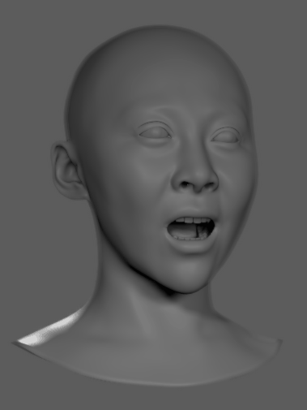

# Using Trained Models in Maya-ACE 2.0


## Install the Plugin

1. Download the pre-built `Maya-ACE` package from [Maya-ACE Releases](https://github.com/NVIDIA/Maya-ACE/releases). Choose version 2.0.0 or later.

2. Unzip the compressed file.

- The contents will look like below:
    ```text
    mace-v2.0.0/
    ├── mace/  # The plugin contents
    ├── PACKAGE-LICENSES/  # License files
    └── mace.mod  # Maya module file
    ```

3. Copy the contents to a [Maya module path](https://help.autodesk.com/view/MAYAUL/2024/ENU/?guid=Maya_SDK_Distributing_Maya_Plug_ins_DistributingUsingModules_InstallingModules_html).

- Maya module path most common examples:
    - `C:/Program Files/Autodesk/Maya2024/modules`
    - `C:/Users/<username>/Documents/maya/modules/`
- Once copied, file structure should look like this:
    ```text
    C:/Program Files/Autodesk/Maya2024/modules
    ├── mace/
    ├── PACKAGE-LICENSES/
    └── mace.mod
    ```

4. Restart Maya

- You should now see the ACE/A2F menu on the main Maya toolbar

&nbsp;&nbsp;&nbsp;&nbsp;&nbsp;&nbsp;&nbsp;&nbsp;&nbsp;&nbsp;&nbsp;&nbsp;

- Open the Plug-in Manager and look for `maya_ace`. Make sure it is loaded and setup to auto-load.

&nbsp;&nbsp;&nbsp;&nbsp;&nbsp;&nbsp;&nbsp;&nbsp;&nbsp;&nbsp;&nbsp;&nbsp;

**Note:** For more details on the Maya-ACE plugin installation or Maya-ACE user information, you can refer to the Maya-ACE documentation on the [Maya-ACE Git Repository](https://github.com/NVIDIA/Maya-ACE).

## Load a Model Made in the Training Framework

There are 2 workflows in Maya-ACE:
- `A2F Player`: use model files to perform animation inference locally
- `ACE Player`: use gRPC protocol to connect to an **A2F NIM** microservice, running locally on the same machine or remotely over a network.

When working with custom trained models, you need to use the A2F Player as opposed to the ACE Player. Whether you want to infer animation for a mesh or a blend shapes setup, when performing inference from a custom trained model, you need the A2F Player.

**Important consideration:** It is critical to understand that custom-trained models are tightly coupled to the specific geometry on which they were trained. For successful animation inference, the target asset must exactly match the asset configuration used during the training process.

- **For Vertex-Based Animations:** If you plan to output animations on vertices, it must be with a mesh that has the exact same topology (i.e., identical vertex count, order, and connectivity) as the training mesh.

- **For Blend Shape-Based Animations:** If you plan to output animations on blend shape weights, it must be with a character that has the exact same blend shape setup (i.e., identical number of blend shapes, corresponding names, and target poses) as the one provided to the Training Framework.

Failure to adhere to this one-to-one correspondence will result in incorrect or failed animation inference.

If you have trained a model based on the Claire sample dataset, you can run animation inference on the Maya sample scene provided in the following folder:

```text
<dataset path>/geom/fullface/a2f_maya_scene.mb
```

This scene has all the nodes that can receive the inference mesh animation from the trained model, as well as nodes that can leverage tongue animations and jaw transformations.

&nbsp;&nbsp;&nbsp;&nbsp;&nbsp;&nbsp;&nbsp;&nbsp;&nbsp;&nbsp;&nbsp;&nbsp;

If you select the head mesh and add an A2F Player using `ACE/A2F -> Create -> A2F Player on Mesh`:

&nbsp;&nbsp;&nbsp;&nbsp;&nbsp;&nbsp;&nbsp;&nbsp;&nbsp;&nbsp;&nbsp;&nbsp;

The following node connections will be made:

&nbsp;&nbsp;&nbsp;&nbsp;&nbsp;&nbsp;&nbsp;&nbsp;&nbsp;&nbsp;&nbsp;&nbsp;

You can see from the node inputs and outputs that the mesh deformation from the A2F Player is driving the deformations on the Claire mesh. Other outputs from the A2F Animation Player node can be connected manually to other components of the scene, such as jaw transforms and eye rotations.

Use the `Modify -> Connect A2F Player to Tongue Mesh` tool to connect the tongue mesh to the network.

&nbsp;&nbsp;&nbsp;&nbsp;&nbsp;&nbsp;&nbsp;&nbsp;&nbsp;&nbsp;&nbsp;&nbsp;

Also of note, you may see the mesh disappear when connecting the A2F Player for the first time:

&nbsp;&nbsp;&nbsp;&nbsp;&nbsp;&nbsp;&nbsp;&nbsp;&nbsp;&nbsp;&nbsp;&nbsp;

This means that the model card needs to be defined in the Maya-ACE user interface.

**Note**: The `Model Card`, `Audio2Emotion` and `Audiofile` all need to be set up for Maya-ACE to work and display the inferenced mesh properly.

### Defining the Model's Card

You can access the A2F Animation player interface by selecting the object `A2FAnimationPlayer1` (if you have multiple players in the scene, the suffix number may vary) in the named selection set `AnimationPlayersSet`:

&nbsp;&nbsp;&nbsp;&nbsp;&nbsp;&nbsp;&nbsp;&nbsp;&nbsp;&nbsp;&nbsp;&nbsp;

Once the A2F Player is selected, you can see its interface in Maya's Attribute Editor:

&nbsp;&nbsp;&nbsp;&nbsp;&nbsp;&nbsp;&nbsp;&nbsp;&nbsp;&nbsp;&nbsp;&nbsp;

From there, you can enter the local path to the `model.json` file produced by the Training Framework. You also need to provide the A2E model configured for your model. Note that the A2E model configuration provided on [Hugging Face - Audio2Emotion](https://huggingface.co/nvidia/Audio2Emotion-v2.2/tree/main) is compatible with the Claire dataset trained model, but you should verify the emotion mappings match your specific model configuration.

&nbsp;&nbsp;&nbsp;&nbsp;&nbsp;&nbsp;&nbsp;&nbsp;&nbsp;&nbsp;&nbsp;&nbsp;

If the TRT models have not been built, you can open the `TRT Manager` by pressing the `Manage Model Files` button or by choosing `Open TRT Model Manager` in the `ACE/A2F` menu. In the `TRT Manager` dialog, you can select your model and press `(Re)Build TRT Files`

&nbsp;&nbsp;&nbsp;&nbsp;&nbsp;&nbsp;&nbsp;&nbsp;&nbsp;&nbsp;&nbsp;&nbsp;

When the TRT models are built and once an audio track is selected in the A2F Player interface, the model will start generating animations.

&nbsp;&nbsp;&nbsp;&nbsp;&nbsp;&nbsp;&nbsp;&nbsp;&nbsp;&nbsp;&nbsp;&nbsp;

You can find more details about the Maya-ACE animation workflow in the Maya-ACE documentation on the [Maya-ACE Git Repository](https://github.com/NVIDIA/Maya-ACE).

## Configure the Audio2Emotion Model

The Audio2Emotion (A2E) model analyzes the vocal characteristics of an audio track to detect and infer emotional states. The A2E model is trained to detect the following 6 core emotion states:

- neutral
- angry
- disgust
- fear
- happy
- sad

In an Audio2Face-3D model, more emotions than those 6 core emotions can be present, depending on the emotion coverage in the dataset. For example, the Claire training dataset contains 10 emotions and a neutral expression.

When defining the dataset for the Training Framework, the emotion list is configured in the `config_dataset.py` file. This definition lists the emotions. The order they are listed in defines their emotion IDs.

In the Claire's training configuration file, you'll find these lines:

```python
# List of emotions used in the training dataset shots with facial animation performance
SHOT_EMOTION_NAMES = [
    "neutral",
    "amazement",
    "anger",
    "cheekiness",
    "disgust",
    "fear",
    "grief",
    "joy",
    "outofbreath",
    "pain",
    "sadness",
]
```

This means that the following IDs are given to the emotions in the list:

- neutral -> -1
- amazement -> 0
- anger -> 1
- cheekiness -> 2
- disgust -> 3
- fear -> 4
- grief -> 5
- joy -> 6
- outofbreath -> 7
- pain -> 8
- sadness -> 9

Since A2E cannot infer all these emotions, you need to provide the A2E model with the IDs that it can infer within the list. These emotions will be auto-detected by A2E and will be part of the facial performance. You also need to define the default state for the preferred emotion. The preferred emotion state can be created from all the emotions in the A2F model's list.

To configure this, locate the `model_config.json` file in the Audio2Emotions model folder. In that file, find the preferred_emotion key and set the values for all emotions to the values you want the model to use by default. A good practice is to set all values to `0.0` unless you want the default state to be different than neutral.

For Claire's dataset, there are 10 emotions in the model, so the vector is made of 10 `0.0` values. Here are the parameters to set in the `model_config.json` file.

```json
{
    "post_processing_config": {
        // ...
        "output_emotion_length": 10,
        "preferred_emotion": [0.0, 0.0, 0.0, 0.0, 0.0, 0.0, 0.0, 0.0, 0.0, 0.0]
        // ...
    }
}
```

From the Claire dataset emotions IDs list, the mapping of the emotions is made in the following section of the `model_config.json` file:

```json
{
    "post_processing_config": {
        // ...
        "emotion_correspondence": {
            "angry": 1,
            "disgust": 3,
            "fear": 4,
            "happy": 6,
            "sad": 9,
            "neutral": -1
        }
        // ...
    }
}
```

The default configuration provided with the A2E model was based on Claire, Mark, and James models, which all shared the same emotions configuration. If you are using one of these models, you can use the file included with the downloaded model.

If you have your own model and emotions list, you can edit the `model_config.json` file to match your emotions list and the A2E model will be ready to use with your `Audio2Face-3D` model.

The configuration process is the same for 2.2 or 3.0 Audio2Emotion models.

[Back](../README.md)
